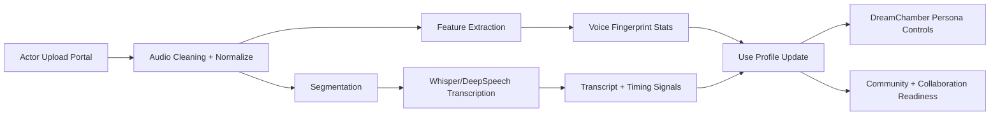

# NOIZY Actor Audio-to-Persona Roadmap

How actor-uploaded media becomes a persistent, evolving NOIZY use profile.

## Pipeline

1. Upload audio media (`wav/mp3/flac/m4a/aac/ogg`)
2. FFmpeg normalization to model-ready WAV (22.05k mono)
3. Optional segmentation for long-form files
4. STT transcription per segment
5. Feature extraction (Librosa when available, basic fallback otherwise)
6. Asset metadata persisted
7. Aggregate use profile updated
8. DreamChamber consumes updated profile

## Visual Map

## API

- `POST /profile/{ava_slug}/audio`
- `GET /profile/{ava_slug}/audio`
- `GET /profile/{ava_slug}/use-profile`

