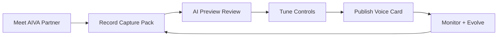

# NOIZY Actor Journey Map

The actor experience is designed to be creative-first and low-friction.

## Outcome

Voice actors focus on performance and creative direction.  
NOIZY handles transcription, training orchestration, synthesis runtime, and delivery.

## Journey (Step-by-Step)

1. **Meet Your AI Partner**
   - Create AVA profile with tone and context defaults.
2. **Record Capture Pack**
   - Submit guided sessions (calm, narrative, dramatic, conversational).
3. **Review AI Preview**
   - Approve/reject generated samples and add correction notes.
4. **Tune Performance Controls**
   - Set pace, emotional range, pronunciation preferences.
5. **Publish Voice Card**
   - Enable approved use cases and licensing tiers.
6. **Monitor and Evolve**
   - Track usage, enforce revocation, upload new samples over time.

## Visual Flow

## API Mapping

- `GET /onboarding/voice-actor-pathway`
- `POST /onboarding/{ava_slug}/progress`
- `GET /onboarding/{ava_slug}/progress`

## Operational Rule

Actors should never need to manage training infrastructure directly.  
All ML internals remain behind NOIZY services and orchestration.

