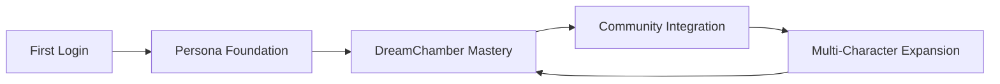

# NOIZY Actor Launch Journey

Visual roadmap from first login to long-term creative expansion.

## Promise

Actors should feel creative, supported, and connected immediately.  
NOIZY handles technical complexity so actors can focus on performance.

## Roadmap

1. **First Login**
   - Covenant review
   - AVA activation
   - Consent controls
2. **Persona Foundation**
   - Capture pack session
   - First AI preview
   - Correction notes
3. **DreamChamber Mastery**
   - Emotion tuning
   - Character template tests
   - Performance control refinement
4. **Community Integration**
   - Composer Guild intro
   - First co-creation session
   - Community challenge publish
5. **Multi-Character Expansion**
   - Publish voice card
   - Enable additional character modes
   - Track usage and iterate

## Visual Flow

## API Endpoint

- `GET /onboarding/actor-launch-journey-map`

