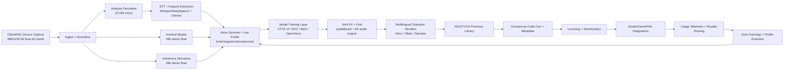

# NOIZYVOX Client#001 AAA Ecosystem Map

Artist-owned, consent-locked, premium voice library pipeline.

## End-to-End Flow



## Productized Asset Layout

```text
RSP_001_AAA/
├── HERO/                # multilingual + emotional renders
├── VILLAIN/             # multilingual + emotional renders
├── NARRATOR/            # multilingual + broadcast variants
├── PHONEME_STEMS/       # source units for custom synthesis
└── CONSENT_CERT/        # rights + policy + usage constraints
```

## Control Points (non-negotiable)

1. Consent locked at source.
2. Raw upload retained for reprocessing as models improve.
3. Derivative strategy preserved (analysis + archival + immersive).
4. Use-profile and quality report versioned over time.
5. Rights metadata attached to every exported asset.

## Delivery Targets

- Runtime-ready voice assets for game/film pipelines.
- Future-ready masters for retraining and new immersive formats.
- Transparent usage records for revenue attribution and audits.

## Bootstrap Client#001 (API)

```bash
curl -X POST http://localhost:8090/ava/ \
  -H "Content-Type: application/json" \
  -H "x-noizy-api-key: YOUR_KEY" \
  -d '{
    "slug":"client001-rsp001",
    "display_name":"Client#001 RSP_001",
    "voice_provider":"piper",
    "stt_provider":"whisper",
    "tone_preset":"heroic"
  }'
```

```bash
curl -X POST http://localhost:8090/onboarding/client001-rsp001/initialize \
  -H "x-noizy-api-key: YOUR_KEY"
```

```bash
curl -X POST http://localhost:8090/profile/client001-rsp001/audio \
  -H "x-noizy-api-key: YOUR_KEY" \
  -F "file=@/absolute/path/to/source.wav"
```

```bash
curl http://localhost:8090/profile/client001-rsp001/quality-report \
  -H "x-noizy-api-key: YOUR_KEY"
```
