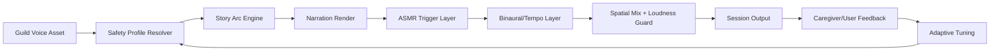

# NOIZYVOX Calming Voice Architecture

## Scope

Architecture for supportive calming audio experiences across sleep and regulation use cases, including neurodiversity-sensitive profiles.

Use supportive wording:
- "can help some listeners feel calmer"
- "supports regulation and sleep preparation"

Avoid medical claims:
- no diagnosis, treatment, or cure statements.

## System Diagram

## Key Layers

### 1. Voice Layer
- Consent-locked narrator assets
- Style presets: neutral / warm / minimal prosody
- No sudden emotional spikes in calming mode

### 2. Trigger Layer
- Soft spoken / whisper-safe variants
- Low-intensity environmental textures
- Trigger allow/deny list per listener profile

### 3. Binaural/Tempo Layer
- Configurable beat offset (e.g., theta-range support)
- Conservative gain defaults
- Disable switch for beat-sensitive listeners

### 4. Haptic Tempo / Subconscious Distraction Layer
- Protocol-synced haptic cues:
  - 4/4/4/4 pulse
  - 4/7/8 exhale-extended pulse
  - acute double-inhale cue + long exhale pulse
- Optional low buzz grounding mode for sensory anchoring
- Designed as non-startling, low-intensity tactile pacing

### 5. Mix Safety Layer
- Loudness normalization
- True-peak guard / limiter
- Soft attack/release envelopes

### 6. Adaptive Layer
- Session outcomes feed profile tuning:
  - calmer / same / activated / overstimulated
- Auto-reduce intensity when activation is reported

## Listener Profiles

- standard_sleep
- high_sensitivity
- neurodiversity_support
- no_binaural

Each profile controls:
- pace
- trigger set
- dynamic range
- session duration cap
- haptic intensity/pattern

## Operational Guardrails

- Always expose "Stop now" control
- Keep session logs auditable
- Version profile rules and story mixes
- Require explicit consent for any biofeedback feature

## Output Metadata Schema (minimum)

- actor_id
- story_id
- profile_id
- beat_config
- trigger_config
- loudness_report
- safety_version
- consent_token_id
