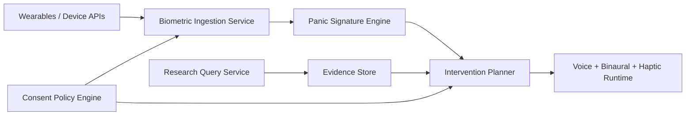

# NOIZYVOX × Claude Health — Technical Integration Spec

## Scope

This specification defines the integration boundary between:

- NOIZYVOX Panic/Calm orchestration
- wearable biometrics inputs (HR, HRV, BP proxies)
- research evidence retrieval (PubMed)
- optional Claude summarization for engineering and clinical-review workflows

This spec is implementation-focused and intentionally avoids treatment claims.

## Goals

1. Keep the biometric pipeline explicit, auditable, and consent-driven.
2. Add literature-backed protocol support (queryable evidence layer).
3. Keep PHI workflows separable from non-PHI research workflows.
4. Preserve creator-voice governance and consent-as-code controls.

## Non-Goals

- Automated diagnosis
- Medical decision making without clinician oversight
- Claiming efficacy beyond validated studies

## System Boundaries



## Data Domains

### PHI / Sensitive Domain

- raw wearable streams
- panic-session timestamps tied to user identity
- intervention telemetry tied to user identity

Constraints:

- explicit opt-in required
- minimum retention policy
- revocation path required
- no model training on user health data unless separately authorized

### Non-PHI Research Domain

- PubMed metadata and abstracts summaries
- protocol evidence notes
- intervention template updates

Constraints:

- no user identifiers
- reproducible query metadata

## Core Services

### 1) Biometric Ingestion

Input example:

```json
{
  "user_id": "anon_or_pseudonymous_id",
  "timestamp": "2026-03-12T19:01:02Z",
  "heart_rate_bpm": 128,
  "hrv_rmssd_ms": 14.0,
  "systolic_bp": 152,
  "diastolic_bp": 96
}
```

Responsibilities:

- schema validation
- consent check
- baseline lookup
- write to secure event store

### 2) Panic Signature Engine

Uses:

- current biometric snapshot
- per-user baseline profile
- episode-history features

Outputs:

- severity score (`none/mild/moderate/acute`)
- recommended protocol (`box_4_4_4_4`, `breathing_4_7_8`, `physiological_sigh`)
- optional haptic deceleration curve

### 3) Intervention Planner

Merges:

- panic-engine output
- runtime capabilities (voice/haptic/audio availability)
- safety rules (max session length, escalation conditions)

Outputs:

- runtime plan JSON consumed by device/app layers

### 4) Research Query Service

Current script:

- `tools/pubmed_research_query.py`

Supports:

- PubMed query and metadata fetch
- optional Claude summarization for engineering/clinical briefing
- JSON output for traceable evidence snapshots

## API/CLI Contracts (Current)

### Panic Mode

- Script: `rsp001_pipeline/scripts/run_panic_mode.py`
- Input: snapshot + baseline JSON
- Output: deterministic intervention plan

### Predictive Haptic Flow

- Script: `rsp001_pipeline/scripts/build_haptic_panic_flow.py`
- Input: snapshot + baseline + episode history JSON
- Output: time-stepped deceleration schedule

### Evidence Query

- Script: `tools/pubmed_research_query.py`
- Input: query string + optional Claude model
- Output: `noizy_platform/docs/data/pubmed-last-query.json`

## Compliance and Governance Controls

1. Consent-as-code gate before biometric ingestion.
2. Separate storage buckets/tables for PHI and non-PHI.
3. Immutable event log for intervention actions.
4. Revocation workflow to disable future biometric inference.
5. Human review gate for protocol changes sourced from literature.

## Failure Modes and Mitigations

- Missing wearable signal:
  - fallback to user-initiated calming protocol
- Elevated metrics persist:
  - escalation branch, optional trusted contact alert
- Evidence query failure:
  - keep prior validated protocol set, log retrieval error

## Rollout Plan

### Phase A (now)

- deterministic panic + haptic planners
- PubMed evidence query tooling
- manual clinician review loop

### Phase B

- wearable ingestion adapters
- signed consent event records
- intervention telemetry dashboards

### Phase C

- controlled pilot with predefined inclusion criteria
- outcomes reporting and protocol versioning
- regulatory and reimbursement pathway package

## Success Metrics

- panic-plan generation latency
- intervention completion rate
- time-to-baseline trend
- false-positive alert rate
- protocol update traceability

## Safety Statement

NOIZYVOX outputs are supportive digital interventions and not medical diagnosis.  
All deployment claims require study-backed validation and clinician governance.

