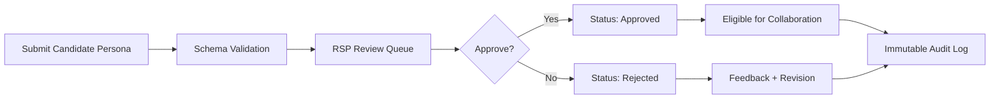

# NOIZYVOX Farm Ecosystem Blueprint
## Artist-First Trust, Collaboration, and Scale

This blueprint implements four concrete deliverables:
1. Portal UI actors can operate daily.
2. Runnable Rob.AVA FastAPI prototype.
3. Legal never-clauses enforced automatically.
4. Safe scaling path from 1 to 10,000 AVAs.

## 1) Portal UI (Actor-Operable)

Design goals:
- Keep creators in flow, not in admin overhead.
- Show ownership, consent, and earnings in one place.
- Make review state and collaboration safety explicit.

```text
NOIZYVOX Farm Portal
├─ Dashboard
│  ├─ Total AVAs
│  ├─ Active sessions
│  ├─ Pending approvals
│  └─ Royalties (period + lifetime)
├─ Characters
│  ├─ Candidate / Approved / Rejected
│  └─ Edit profile + collaboration rules
├─ Collaboration
│  ├─ Allowed partners
│  ├─ Session safety check
│  └─ Session logs
├─ Trust & Consent
│  ├─ Consent level
│  ├─ Never-clauses status
│  └─ Audit trail
└─ Analytics
   ├─ Usage by language
   ├─ Earnings by character
   └─ Collaboration performance
```

## 2) Persona Schema (Trust Contract)

- Schema: [persona_profile.schema.json](/Users/m2ultra/NOIZYLAB/rob_ava/persona_profiles/persona_profile.schema.json)
- Example: [rsp001_candidate.example.json](/Users/m2ultra/NOIZYLAB/rob_ava/persona_profiles/rsp001_candidate.example.json)

Required trust fields:
- `persona_id`, `owner_id`, `display_name`
- `languages`, `consent_level`
- `collaboration_rules.allowed_partners`
- `collaboration_rules.restricted_topics`
- `collaboration_rules.max_interaction_duration`

## 3) Approve / Reject UX Loop (Trust)



Decision inputs:
- Range quality and character fit.
- Consent boundaries and safety config.
- Crew-level fit for collaboration.

## 4) AVA Collaboration Rules (Safe by Default)

Session authorization checks:
- Persona must be `approved`.
- Partner must be in `allowed_partners`.
- Requested duration must be <= `max_interaction_duration`.
- Topics must not intersect persona `restricted_topics` or global blocked topics.

Global never-clauses policy:
- [never_clauses.json](/Users/m2ultra/NOIZYLAB/rob_ava/policy/never_clauses.json)

## 5) Rob.AVA Weekend Prototype (Runnable)

Server:
- [server.py](/Users/m2ultra/NOIZYLAB/rob_ava/server.py)
- [rob_ava_50line.py](/Users/m2ultra/NOIZYLAB/rob_ava/rob_ava_50line.py) (minimal starter)

Run:

```bash
uvicorn rob_ava.server:app --reload --port 8091

# or minimal 50-line starter
uvicorn rob_ava.rob_ava_50line:app --reload --port 8092
```

Core endpoints:
- `POST /ava/create`
- `POST /ava/review/{persona_id}?approve=true|false&reason=...`
- `GET /ava/list`
- `POST /ava/session/authorize/{persona_id}`

Example create:

```bash
curl -X POST "http://127.0.0.1:8091/ava/create" \
  -H "Content-Type: application/json" \
  -d @rob_ava/persona_profiles/rsp001_candidate.example.json
```

Example review:

```bash
curl -X POST "http://127.0.0.1:8091/ava/review/rsp001_commander_v1?approve=true&reason=meets%20crew%20standard"
```

Example collaboration check:

```bash
curl -X POST "http://127.0.0.1:8091/ava/session/authorize/rsp001_commander_v1" \
  -H "Content-Type: application/json" \
  -d '{"partner_id":"persona_5678","duration_seconds":240,"topics":["cinematic dialog"]}'
```

## 6) Legal Never-Clauses (Enforced Automatically)

The service blocks or denies execution when a clause is violated:
- No data sharing without explicit owner consent.
- No consent key bypass.
- No restricted-topic session.
- No session beyond duration limits.
- No persona changes without audit record.
- No disabling of audit logging.

## 7) Scaling Map (1 → 100 → 10,000)

| Scale | Runtime | Data Model | Governance | Safety Controls |
|---|---|---|---|---|
| 1 AVA | Single process FastAPI | JSON file | Manual RSP review | Never-clauses + local logs |
| 100 AVAs | FastAPI + Postgres | Persona + review + session tables | Queue-based approvals | Policy engine + per-session auth |
| 10,000 AVAs | Sharded services + event bus | Multi-tenant partitions | RSP + delegated reviewers + audit board | Global policy service, immutable audit ledger, anomaly detection |

Migration path:
1. Keep schema stable from day one.
2. Replace file DB with SQL while preserving endpoint contracts.
3. Extract policy checks into a dedicated policy service.
4. Add signed audit events for regulator/client assurance.

## 8) Build Rule

No feature bypasses:
- owner consent,
- review state,
- collaboration safety checks,
- auditability.

If a feature cannot satisfy all four, it does not ship.
