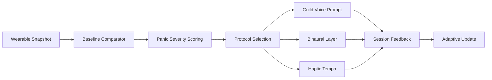

# NOIZYVOX Panic Mode Technical Spec (Supportive Intervention)

## Scope

Biometric-triggered calm intervention that selects a voice-guided breathing protocol, optional binaural support, and optional haptic tempo guidance.

Positioning: supportive regulation workflow, not medical diagnosis or treatment.

## Trigger Inputs

- Heart rate (HR)
- Heart-rate variability (HRV)
- Optional blood pressure (BP)

## Decision Pipeline



## Severity Scoring (v1)

- `mild`: moderate HR increase and/or HRV reduction
- `moderate`: stronger HR/HRV deviation
- `acute`: combined strong HR increase + HRV collapse (+ optional BP spike)

## Protocol Mapping

- `mild` -> `box_4_4_4_4`
- `moderate` -> `breathing_4_7_8`
- `acute` -> `physiological_sigh`

## Haptic Modes

- Box pacing pulse (4/4/4/4)
- Long-exhale pacing pulse (4/7/8)
- Double-inhale cue + long exhale pulse
- Optional low buzz grounding mode (future hardware profile)

## Binaural Defaults

- mild: alpha-support range
- moderate: alpha/theta bridge
- acute: theta-support emphasis
- disabled automatically in `no_binaural` profile

## Runtime Profiles

- `standard_sleep`
- `high_sensitivity`
- `neurodiversity_support`
- `no_binaural`

## Fail-safe Behavior

- If wearable stream unavailable, fallback to voice-only paced breathing
- Always expose manual stop + trusted-contact path
- Escalation message on persistent acute state

## Data Contracts

Input snapshot JSON:

```json
{
  "heart_rate_bpm": 118,
  "hrv_rmssd": 22.4,
  "systolic_bp": 142,
  "diastolic_bp": 90
}
```

Baseline profile JSON:

```json
{
  "resting_hr_bpm": 68,
  "resting_hrv_rmssd": 44.0,
  "resting_systolic_bp": 118
}
```

Output intervention plan includes:
- severity score
- selected protocol
- voice style
- beat configuration
- haptic sequence
- escalation flag

## Compliance Notes

- No panic-mode copy should claim cure, diagnosis, or guaranteed outcomes.
- Product must state emergency-care escalation conditions clearly.
