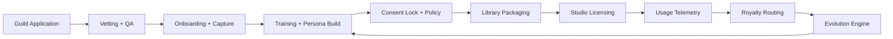
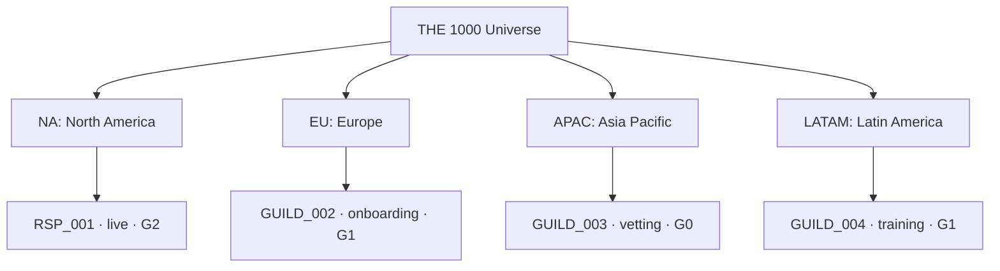

# NOIZYVOX THE 1000 — Universe Map

Generated: 2026-03-12 14:28:32 EDT
Data version: `v1`

## Program Targets

- Guild members target: **1000**
- Core archetypes: **8**
- Primary languages: **17**
- Cultural layers: **7**

## System Map

## Sovereign Node Topology (Current Dataset)

## Status Snapshot

| Status | Count |
|---|---:|
| live | 1 |
| onboarding | 1 |
| training | 1 |
| vetting | 1 |

## Regional Progress (Live vs Target)

| Region | Label | Target | Live | Progress % |
|---|---|---:|---:|---:|
| NA | North America | 180 | 1 | 0.6 |
| LATAM | Latin America | 140 | 0 | 0.0 |
| EU | Europe | 170 | 0 | 0.0 |
| MENA | Middle East & North Africa | 120 | 0 | 0.0 |
| SSA | Sub-Saharan Africa | 110 | 0 | 0.0 |
| APAC | Asia Pacific | 220 | 0 | 0.0 |
| INDIG | Indigenous / Cultural Keepers | 60 | 0 | 0.0 |

## Language Coverage Snapshot (Top 10)

| Language | Members |
|---|---:|
| en | 3 |
| es | 2 |
| fr | 2 |
| de | 1 |
| ja | 1 |
| ko | 1 |
| pt | 1 |

## Archetype System (Core 8)

- Commander
- Broken
- Ancient
- Predator
- Fool
- Lover
- Child
- Ghost

## Cultural Intelligence Layers (7)

- Linguistic
- Prosodic
- Social
- Mythological
- Humour
- Grief
- Sacred

## Member Registry (Current Dataset)

| ID | Name | Region | Status | Evolution Gen | Archetypes | Languages | Dialects | Verticals |
|---|---|---|---|---:|---|---|---|---|
| RSP_001 | R.S. Plowman | NA | live | 2 | Commander, Ancient, Ghost | en, es, fr | en-US, en-UK, es-MX | AAA Games, Animation, Narration |
| GUILD_002 | Candidate 002 | EU | onboarding | 1 | Broken, Lover, Fool | en, de, fr | de-DE, fr-FR | Film, Audiobooks |
| GUILD_003 | Candidate 003 | APAC | vetting | 0 | Predator, Commander | ja, ko, en | ja-JP, ko-KR | AAA Games, Interactive NPC |
| GUILD_004 | Candidate 004 | LATAM | training | 1 | Child, Ghost, Ancient | es, pt | es-MX, es-CO, pt-BR | Education, Animation |

## How To Update

1. Edit `noizy_platform/docs/data/noizyvox-the-1000-universe.json`.
2. Run `python3 tools/build_universe_map.py`.
3. Re-open this map from workstation command router.