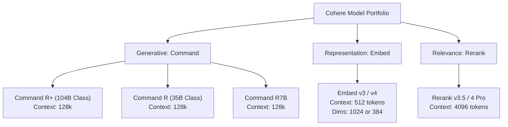

# Cohere Platform & Developer Ecosystem: Deep Research

This specification provides a deep dive into Cohere's AI platform, focusing on single-user developer tiers, core model architectures (Command, Embed, Rerank), pricing models, and practical Python SDK integration patterns for agentic workflows.

---

## 1. The Developer Free Tier (Single User)

Cohere offers a generous, zero-cost developer tier called the **Trial API Key**. This tier is designed specifically to allow single users, developers, and researchers to experiment, build prototypes, and integrate Cohere's capabilities into their personal projects or workflows.

> [!IMPORTANT]
> **Key Terms of Use:**
> - **Exclusively Non-Commercial:** Trial keys are strictly prohibited from being used in production environments, commercial applications, or public-facing systems.
> - **Self-Serve Access:** A Trial API key is automatically generated upon account registration at the [Cohere Dashboard](https://dashboard.cohere.com) without requiring credit card details.

### Trial Key Rate Limits
To prevent abuse while remaining highly usable for prototyping, Cohere enforces per-minute and monthly rate limits on Trial keys:

| Endpoint | Free Tier Limit | Behavior on Limit |
| :--- | :--- | :--- |
| **Chat API** (Command R / R+) | **20 requests per minute** (RPM) | Triggers `429 HTTP` (Rate limit reached) |
| **Embed API** (Embed v3 / v4) | **5 requests per minute** (RPM) | Triggers `429 HTTP` (Rate limit reached) |
| **Rerank API** (Rerank v3.5) | **1,000 requests per month** (combined) | Triggers `429 HTTP` (Rate limit reached) |
| **Tokenize / Detokenize** | **100 requests per minute** (RPM) | Triggers `429 HTTP` (Rate limit reached) |

> [!TIP]
> For single-user agentic workflows, **20 RPM for Chat** is typically sufficient for local execution, script triggers, and desktop assistants. However, if your agent processes search results or files in parallel, you must implement request scheduling or back-off logic to avoid hitting the 20 RPM limit.

---

## 2. Cohere Model Portfolio & Technical Specifications

Cohere categorizes its models into three distinct pillars: **Generative (Command)**, **Representation (Embed)**, and **Relevance (Rerank)**.



### Generative Models: Command R & Command R+
The Command family is natively optimized for **Retrieval-Augmented Generation (RAG)**, structured tool use, and multi-step agentic workflows.

*   **Command R+ (104B parameter class):** Cohere's state-of-the-art enterprise model. It features advanced multi-step tool use, high multilingual performance across 10+ core languages, and a large context window.
*   **Command R (35B/32B parameter class):** A highly efficient model offering a balance of performance, low latency, and cost-effectiveness. It is ideal for most agentic tasks that do not require massive reasoning overhead.
*   **Command R7B:** A small, fast-inference model tailored for lightweight deployments and low-latency interaction.

**Key Specifications:**
*   **Context Window:** **128,000 tokens** across all Command R / R+ models.
*   **Multilingual Support:** Trained on 10 languages (English, French, Spanish, Italian, German, Portuguese, Chinese, Japanese, Korean, Arabic).
*   **Structured Outputs:** Native JSON schema response constraint support.

---

### Representation Models: Embed v3 & Embed v4
The Embed family converts text (and images in v4) into vector representations for semantic search, clustering, and classification.

*   **Context Window:** **512 tokens** (inputs exceeding this are truncated).
*   **Dimensions:** Available in **1024 dimensions** (large/multilingual) or **384 dimensions** (lightweight/low-latency).
*   **Compression-Awareness:** Embed v3/v4 natively supports outputting **int8** or **binary** vector formats. This reduces vector database storage size by up to 96% and speeds up search queries significantly while retaining over 99% of retrieval accuracy.

---

### Relevance Models: Rerank v3.5 & Rerank 4
Rerank is a specialized cross-encoder model that takes a query and a set of candidate document snippets, computing a precise relevance score for each document.

*   **Context Window:** **4,096 tokens**.
*   **How it Works:** In a traditional search pipeline, keyword or vector search (bi-encoders) retrieves the top 100 candidates. Rerank evaluates these candidates sequentially, identifying the most relevant documents (e.g., top 5) to feed into the generative LLM's context.
*   **Semi-Structured Data:** Rerank v3.5 is trained to score structured JSON objects, code fragments, and metadata, making it highly effective for databases and code repositories.

---

## 3. Production & Pay-As-You-Go Pricing

If your application scales beyond the free Trial Key limits or requires commercial utilization, upgrading to a **Production API Key** enables pay-as-you-go billing with higher rate limits (typically **10,000+ RPM**).

### Cohere Production Pricing (Developer API Rates)

| Model Category | Model Name | Input Pricing | Output Pricing |
| :--- | :--- | :--- | :--- |
| **Generative** | Command R+ | $2.50 / 1M tokens | $10.00 / 1M tokens |
| | Command R | $0.15 / 1M tokens | $0.60 / 1M tokens |
| | Command R7B | $0.0375 / 1M tokens | $0.15 / 1M tokens |
| **Representation**| Embed v3 / v4 (Text) | $0.10 / 1M tokens | N/A |
| | Embed v4 (Image) | $0.40 / 1M tokens | N/A |
| **Relevance** | Rerank 4 Fast | $2.00 / 1,000 searches | N/A |
| | Rerank 4 Pro | $2.50 / 1,000 searches | N/A |

### Production Upgrade Process
1.  **Billing Profile:** Add a credit card to your account under the dashboard's "Billing" tab.
2.  **Disclosure:** Accept the terms of service and indicate if your application involves "sensitive use cases" (e.g., medical, legal, financial advice, or automated decisions).
3.  **Review Phase:** Non-sensitive use cases are approved instantly. Sensitive applications may undergo a manual safety audit taking up to 72 hours.

---

## 4. Agentic Workflow Implementation (Python SDK V2)

Cohere's python client offers a streamlined `ClientV2` API for handling complex agentic workflows, tool use, and multi-turn loops.

### Cohere SDK v2 Tool-Use Code Pattern

This complete script demonstrates a recursive tool execution loop. The agent decides which local functions (tools) to run, executes them, and passes the results back to the model until it can formulate a final answer.

```python
import os
import json
import cohere

# Initialize Cohere Client V2
# Ensure COHERE_API_KEY is set in your environment variables
api_key = os.getenv("COHERE_API_KEY")
if not api_key:
    raise ValueError("COHERE_API_KEY environment variable is not set.")

co = cohere.ClientV2(api_key)

# ---------------------------------------------------------
# Step 1: Define Local Python Tools
# ---------------------------------------------------------

def search_files(directory: str, extension: str) -> dict:
    """Simulates searching a directory for files matching a specific extension."""
    print(f"-> executing search_files: dir='{directory}', ext='{extension}'")
    # Simulation return data
    return {
        "status": "success",
        "directory": directory,
        "files": [f"report.{extension}", f"audit.{extension}", f"logs.{extension}"]
    }

def read_file_content(filepath: str) -> dict:
    """Simulates reading the text content of a specified file."""
    print(f"-> executing read_file_content: path='{filepath}'")
    if "report" in filepath:
        return {"content": "Project Status: Green. System performance at 99.8% capacity."}
    return {"content": "File is empty or access denied."}

# Map strings to the actual python functions for execution
TOOL_MAP = {
    "search_files": search_files,
    "read_file_content": read_file_content
}

# ---------------------------------------------------------
# Step 2: Define Tool Schemas (JSON/OpenAPI format)
# ---------------------------------------------------------

tools = [
    {
        "type": "function",
        "function": {
            "name": "search_files",
            "description": "Searches for files with a specific extension in a local directory.",
            "parameters": {
                "type": "object",
                "properties": {
                    "directory": {
                        "type": "string",
                        "description": "The target folder path (e.g. '/Users/m2ultra/mcp-master/documentation')."
                    },
                    "extension": {
                        "type": "string",
                        "description": "The file extension to filter by, without the dot (e.g. 'md', 'json')."
                    }
                },
                "required": ["directory", "extension"]
            }
        }
    },
    {
        "type": "function",
        "function": {
            "name": "read_file_content",
            "description": "Reads and returns the text contents of a target file path.",
            "parameters": {
                "type": "object",
                "properties": {
                    "filepath": {
                        "type": "string",
                        "description": "The absolute or relative file path to read."
                    }
                },
                "required": ["filepath"]
            }
        }
    }
]

# ---------------------------------------------------------
# Step 3: Run the Agent Loop
# ---------------------------------------------------------

def run_agentic_workflow(user_prompt: str, model_name: str = "command-r-plus"):
    print(f"Prompt: {user_prompt}\n")
    
    # Initialize message history
    messages = [{"role": "user", "content": user_prompt}]
    
    max_steps = 5  # Safety threshold to prevent infinite tool calling loops
    
    for step in range(max_steps):
        print(f"--- Agent Reasoning Step {step + 1} ---")
        
        # Call the Cohere chat endpoint with tools
        response = co.chat(
            model=model_name,
            messages=messages,
            tools=tools
        )
        
        # Check if the model wants to call tools
        tool_calls = response.message.tool_calls
        
        if not tool_calls:
            # No tools requested. The agent is ready to output the final answer.
            print("\nFinal Agent Response:")
            print(response.message.content)
            break
            
        # Add the model's message (which contains the tool calls) to history
        messages.append({
            "role": "assistant",
            "tool_calls": [
                {
                    "id": tc.id,
                    "type": "function",
                    "function": {
                        "name": tc.function.name,
                        "arguments": tc.function.arguments
                    }
                } for tc in tool_calls
            ]
        })
        
        # Execute each requested tool call
        for tc in tool_calls:
            tool_name = tc.function.name
            tool_args = json.loads(tc.function.arguments)
            tool_id = tc.id
            
            if tool_name in TOOL_MAP:
                # Run the actual local function
                func = TOOL_MAP[tool_name]
                result = func(**tool_args)
                
                # Append the function result to messages
                messages.append({
                    "role": "tool",
                    "tool_call_id": tool_id,
                    "content": json.dumps(result)
                })
            else:
                error_msg = {"error": f"Tool '{tool_name}' is not registered."}
                messages.append({
                    "role": "tool",
                    "tool_call_id": tool_id,
                    "content": json.dumps(error_msg)
                })

# Example run:
if __name__ == "__main__":
    # We ask a prompt that requires searching for files first, then reading a report
    run_agentic_workflow(
        user_prompt="Find markdown files in '/Users/m2ultra/mcp-master/documentation' and read the report to tell me the system status."
    )
```

---

## 5. Key Synthesis & Integration Recommendation

When building local pipelines using MCP (Model Context Protocol) and Cohere:
1.  **Rate-Limit Management:** Ensure your MCP servers use a retry decorator or basic queues if they handle multiple calls within a minute on a developer key.
2.  **Rerank for Context Optimization:** Use **Rerank v3.5** to trim vector search contexts down before passing them to Command R / Command R+. This dramatically reduces input tokens, staying well below both rate limits and context pollution issues.
3.  **Embed Storage:** Leverage the **int8/binary** compression options of the Embed models to store vector indices on your local disk without eating up memory or disk space.
