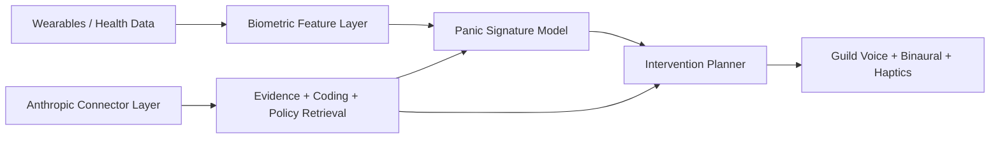

# Anthropic + Open-Source Integration Plan (NOIZYVOX)

## Short Answer

Yes. You can integrate:
- Anthropic/Claude healthcare and life-science connectors
- open-source biometric processing libraries
- open standards (FHIR/OMH-style pipelines)

into the Panic/Calm stack.

## Verified Anthropic Capabilities (as of Mar 12, 2026)

### Healthcare/Life-Science Connectors

Available connector/tutorial surfaces include:
- PubMed
- ICD-10
- CMS Coverage
- NPI Registry
- ClinicalTrials.gov
- Medidata
- HealthEx

These are exposed through Claude connector workflows and MCP-compatible tool patterns.

### HIPAA-Ready Configuration

Claude offers HIPAA-ready Enterprise configurations with BAA for eligible services.

Important constraints:
- feature availability depends on plan/configuration
- not all product surfaces/features are covered equally under HIPAA-ready terms
- legal/compliance review is required before production PHI workflows

## Practical Architecture for NOIZYVOX



## Open-Source Components to Pair

- NeuroKit2 for physiological processing (HRV/respiration signals)
- PyTorch for panic-signature modeling
- Your existing NOIZY pipelines (voice, haptic flow, adaptive profiles)

## Implementation Notes

1. Keep PHI path separated from general analytics.
2. Require explicit user consent and revocation workflow.
3. Log intervention outputs with minimum necessary data.
4. Keep clinical claims out of product copy until validated by study.

## Next Build in Repo

- `tools/pubmed_research_query.py` for PubMed evidence pulls + optional Claude summary.
- Panic-mode model can consume those outputs as literature context, not live diagnosis.

## Quick Commands

```bash
# Help
python3 tools/pubmed_research_query.py --help

# Run query and save JSON evidence snapshot
python3 tools/pubmed_research_query.py \
  --query "binaural beats anxiety heart rate variability" \
  --retmax 12 \
  --output noizy_platform/docs/data/pubmed-last-query.json

# Optional Claude summary (requires ANTHROPIC_API_KEY)
python3 tools/pubmed_research_query.py \
  --query "haptic biofeedback panic intervention wearable" \
  --anthropic-model "<your-claude-model-id>" \
  --output noizy_platform/docs/data/pubmed-last-query.json
```
