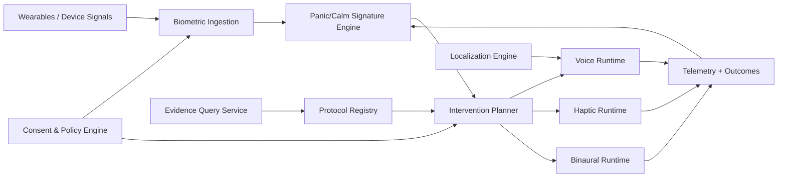

# Global Audio for Calm & Healing Blueprint

## Purpose

Define a production architecture for NOIZYVOX that combines:

- biometric sensing
- adaptive voice + haptics + binaural audio
- protocol evidence ingestion
- culturally localized delivery

This blueprint is engineering-focused and supports clinician-governed validation paths.

## Safety Position

- Supportive intervention system, not autonomous diagnosis.
- Clinical claims require study-backed validation.
- User consent is required for biometric collection and can be revoked.
- Child and accessibility pathways require stricter defaults and governance.

## System Objectives

1. Detect and de-escalate panic/stress quickly.
2. Improve calm/sleep onset through personalized audio-haptic entrainment.
3. Adapt interventions over time using user-specific pattern memory.
4. Localize delivery by language, dialect, and cultural context.
5. Keep architecture compliant, auditable, and modular.

## Layered Runtime Model

```text
L1  Base Frequency Layer      -> haptic + binaural base rhythm
L2  Subconscious Entrainment  -> tempo deceleration / false heartbeat
L3  Guild Voice Layer         -> consent-locked, culturally adapted calming voice
L4  Brainwave Assist Layer    -> alpha/theta/delta support profiles
L5  Context Engine            -> time/event/location-aware pre-load rules
L6  Pattern Memory            -> episode history + predictive interception
L7  Recovery/Sleep Layer      -> post-event stabilization and deep-rest tail
```

## Reference Architecture



## Core Services

### 1) Biometric Ingestion Service

Inputs:

- heart rate
- HRV (e.g., RMSSD/SDNN)
- blood pressure proxies or direct values
- optional respiration / EDA / sleep state

Responsibilities:

- schema validation
- consent enforcement
- baseline profile lookup
- secure event write

### 2) Panic/Calm Signature Engine

Computes:

- severity class (`none/mild/moderate/acute`)
- confidence score
- pre-episode probability (predictive mode)

Consumes:

- current snapshot
- baseline profile
- episode history features

### 3) Intervention Planner

Selects:

- breathing protocol
- haptic pattern + tempo curve
- voice script bundle + pacing
- binaural profile

Constraints:

- safety caps (max session length/intensity)
- modality availability (watch-only, earbuds-only, full stack)

### 4) Runtime Executors

- **Voice Runtime:** trusted Guild voice prompts and pacing.
- **Haptic Runtime:** pulse/buzz envelopes for subconscious entrainment.
- **Binaural Runtime:** alpha/theta/delta compatible layers with volume guards.

### 5) Evidence Query Service

Purpose:

- retrieve and summarize current research for protocol iteration
- produce clinician-readable evidence snapshots

Current tooling:

- `tools/pubmed_research_query.py`

### 6) Localization Engine

Provides:

- language/dialect routing
- culturally appropriate phrasing cadence
- low-stimulus content variants for sensitive profiles

### 7) Telemetry & Outcomes

Tracks:

- time to de-escalation
- intervention completion
- recurrence within window
- session-level user feedback

## Data Contracts

### Biometric Snapshot (example)

```json
{
  "timestamp": "2026-03-12T19:01:02Z",
  "heart_rate_bpm": 132,
  "hrv_rmssd_ms": 16.4,
  "systolic_bp": 148,
  "diastolic_bp": 94
}
```

### Intervention Plan (example)

```json
{
  "severity": "moderate",
  "protocol": "breathing_4_7_8",
  "haptics": {
    "mode": "breath_guide",
    "start_bpm": 116,
    "end_bpm": 76,
    "duration_seconds": 240
  },
  "audio": {
    "voice_profile": "guild_calm_en_na",
    "binaural_profile": "alpha_10hz_support"
  }
}
```

## Device Delivery Modes

1. **Audio-only:** voice + binaural.
2. **Haptic-only:** low-buzz/pulse guidance.
3. **Hybrid:** synchronized voice + haptic + binaural.
4. **Accessibility mode:** haptic-first plus optional bone-conduction voice.

## Protocol Families

- Panic de-escalation
- Anxiety pre-event regulation
- Sleep onset support
- Neurodiversity-safe low-stim pathways

Each protocol has:

- trigger thresholds
- contraindication notes
- session caps
- escalation policy

## Compliance & Governance Boundaries

- explicit opt-in for biometric capture
- revocation and data access controls
- minimum-necessary data retention
- separate PHI and non-PHI paths
- immutable intervention event audit logs

## Rollout Plan

### Phase 0 (Now)

- deterministic panic planning and haptic flow generation
- evidence query tooling
- internal validation with synthetic/demo data

### Phase 1

- live wearable ingestion adapters
- secure consent registry
- operator dashboard and guardrails

### Phase 2

- pilot cohorts with defined inclusion/exclusion criteria
- outcomes instrumentation and protocol versioning
- clinician review loop

### Phase 3

- broader localization coverage
- accessibility-first product variants
- regulatory/reimbursement pathway package

## Engineering Work Packages

1. Build ingestion adapters for Apple/Android health streams.
2. Add feature store for panic signature model inputs.
3. Implement protocol registry with evidence version IDs.
4. Add real-time orchestration bus for voice/haptic/binaural sync.
5. Add model monitoring and false-positive/false-negative tracking.
6. Add localization QA harness for cultural/language variants.
7. Add secure export tooling for research and funding deliverables.

## Success Metrics

- median panic intervention start latency
- median time-to-baseline
- recurrence reduction over 30 days
- protocol adherence rate
- user-reported calm score delta
- dropout rate by modality

## Funding Narrative Fit

This blueprint supports proposals where:

- the intervention is technically credible
- evidence ingestion is reproducible
- safety/compliance boundaries are explicit
- clinician governance and pilot outcomes are measurable

