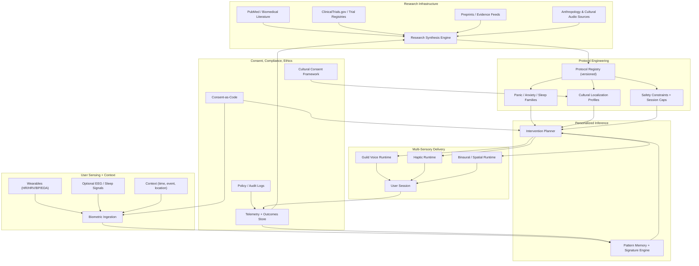
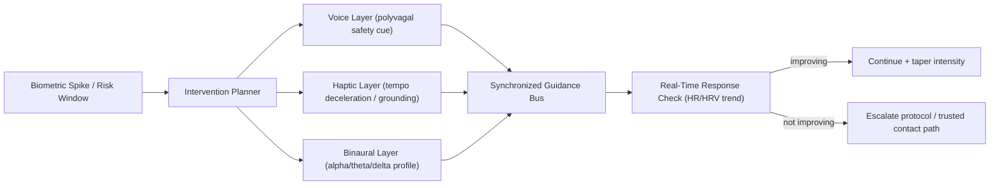
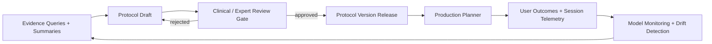
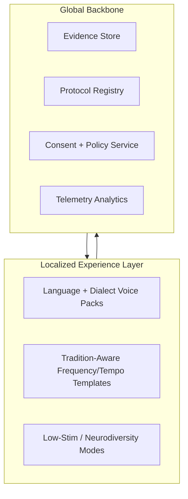

# Global Audio for Calm & Healing — Complete System Diagram

## 1) End-to-End Platform Architecture

## 2) Multi-Sensory Runtime Stack (Session-Level)

## 3) Research-to-Deployment Feedback Loop

## 4) Global Deployment Topology

## Build Notes

- This diagram pairs with:
  - `global-audio-calm-healing-blueprint.md`
  - `world-healing-library-architecture.md`
  - `cultural-consent-framework.md`
- Treat protocol outputs as supportive interventions until clinically validated.

