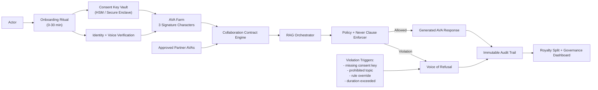
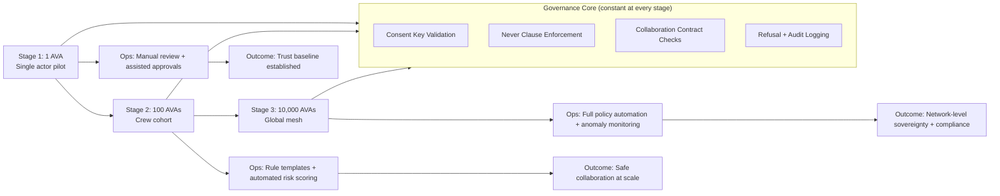

# Rob.AVA Safe Collaboration Mesh

## System Map

```mermaid
flowchart LR
    A["Actor"] --> B["Onboarding Ritual\n(0-30 min)"]
    B --> C["Consent Key Vault\n(HSM / Secure Enclave)"]
    B --> D["Identity + Voice Verification"]
    C --> E["AVA Farm\n3 Signature Characters"]
    D --> E

    E --> F["Collaboration Contract Engine"]
    F --> G["RAG Orchestrator"]
    G --> H["Policy + Never Clause Enforcer"]

    H -->|"Allowed"| I["Generated AVA Response"]
    H -->|"Violation"| J["Voice of Refusal"]

    I --> K["Immutable Audit Trail"]
    J --> K

    K --> L["Royalty Split + Governance Dashboard"]
    M["Approved Partner AVAs"] --> F

    N["Violation Triggers:\n- missing consent key\n- prohibited topic\n- rule override\n- duration exceeded"] --> J
```

## Scale Map (1 -> 100 -> 10,000 AVAs)

```mermaid
flowchart LR
    S1["Stage 1: 1 AVA\nSingle actor pilot"] --> S2["Stage 2: 100 AVAs\nCrew cohort"] --> S3["Stage 3: 10,000 AVAs\nGlobal mesh"]

    subgraph CORE["Governance Core (constant at every stage)"]
      C1["Consent Key Validation"]
      C2["Never Clause Enforcement"]
      C3["Collaboration Contract Checks"]
      C4["Refusal + Audit Logging"]
    end

    S1 --> CORE
    S2 --> CORE
    S3 --> CORE

    S1 --> O1["Ops: Manual review + assisted approvals"]
    S2 --> O2["Ops: Rule templates + automated risk scoring"]
    S3 --> O3["Ops: Full policy automation + anomaly monitoring"]

    O1 --> R1["Outcome: Trust baseline established"]
    O2 --> R2["Outcome: Safe collaboration at scale"]
    O3 --> R3["Outcome: Network-level sovereignty + compliance"]
```
