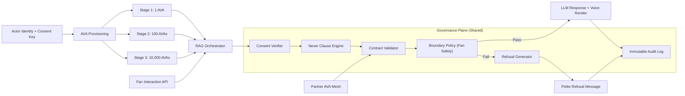
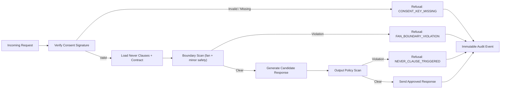

# Rob.AVA Scaling Architecture (1 -> 100 -> 10,000 AVAs)

## Topology + Governance Flow

## Consent Propagation + Refusal Messaging

## Stage Outcomes
- `1 AVA`: manual supervision, fast policy tuning, baseline trust metrics.
- `100 AVAs`: template contracts, automated refusal tiers, batched audit analytics.
- `10,000 AVAs`: full policy automation, anomaly detection, jurisdiction overlays.
