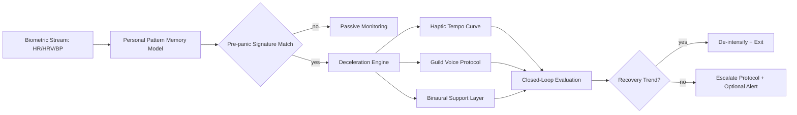

# Sonic Aid Triple-Vector Predictive Haptic Blueprint

## Objective

Define a buildable architecture for preemptive panic interception using synchronized:
- voice guidance (over)
- binaural/audio entrainment (through)
- haptic tempo control (under)

## System Architecture

## Hardware Topology

- Wrist wearable:
  - primary haptic pulse output
  - HR/HRV input
- Mastoid patch (concept):
  - optional bone-conduction + local haptic grounding
- Earbuds:
  - binaural audio delivery
  - optional in-ear biometric stream

## Deceleration Engine

Inputs:
- current HR
- baseline HR/HRV
- severity classification
- historical response profile

Outputs:
- target pulse BPM schedule
- haptic intensity schedule
- beat-difference configuration
- voice protocol selection

## Haptic Modes

1. False-heartbeat deceleration pulse
2. Breathing metronome pulse
3. Low-buzz grounding
4. Distinct grounding pulse

## Predictive Pattern Memory

Model features:
- time-of-day and context windows
- HR spike shape
- HRV collapse slope
- BP trajectory
- intervention response latency

Goal:
- shift activation from reactive mode to preemptive mode.

## Data Contracts

Event record fields:
- timestamp
- snapshot metrics
- severity score
- selected protocol
- pulse curve summary
- recovery markers
- user/caregiver outcome tag

## Safety Constraints

- no-stimulus-startle policy
- max intensity caps
- explicit manual stop
- trusted-contact escalation path
- conservative copy: supportive intervention, not clinical treatment claim

## Build Phases

Phase 1:
- deterministic rules + thresholds
- closed-loop response validation

Phase 2:
- per-user adaptive models
- protocol personalization

Phase 3:
- controlled trial pathway with ethics oversight
