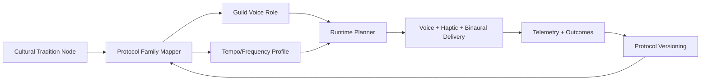

# NOIZYVOX Global Healing Library — Architecture

Generated: 2026-03-12 14:55:24 EDT
Data version: `v1`

## Scope

A data-driven mapping of global sonic traditions into NOIZYVOX protocol families, Guild voice roles, and runtime delivery constraints.

## System Flow

## Protocol Families

- `panic_deescalation`
- `anxiety_pre_event`
- `sleep_onset`
- `post_meltdown_recovery`
- `group_calm_session`

## Coverage Snapshot

| Dimension | Count |
|---|---:|
| Tradition nodes | 8 |
| Protocol families | 5 |
| Safety profiles | 2 |

## Family Distribution

| Protocol Family | Traditions |
|---|---:|
| anxiety_pre_event | 2 |
| group_calm_session | 1 |
| panic_deescalation | 1 |
| post_meltdown_recovery | 1 |
| sleep_onset | 3 |

## Safety Profile Distribution

| Safety Profile | Traditions |
|---|---:|
| low_stim | 7 |
| medium_stim | 1 |

## Tradition-to-Protocol Mapping

| ID | Tradition | Region | Modalities | Tempo BPM | Frequency Focus | Guild Voice Role | Languages | Protocol Family | Safety |
|---|---|---|---|---|---|---|---|---|---|
| aboriginal_songline | Aboriginal Australia Songline | Oceania | drone, breath_pacing, narrative_chant | 48-72 | sub-200 resonance + low drone bed | Elder Narrator | English, local Indigenous language (opt-in) | sleep_onset | low_stim |
| tibetan_bowl_chant | Tibetan Bowl + Chant | Himalayan | harmonic_overtone, sustained_tone, chant | 40-64 | overtone stack + gentle alpha assist | Monastic Guide | Tibetan, Mandarin, English | anxiety_pre_event | low_stim |
| west_african_drum_griot | West African Drum + Griot | West Africa | rhythmic_entrainment, storytelling, call_response | 60-84 | pulse-led rhythm with controlled transient caps | Griot Guide | Yoruba, Mandinka, Wolof, English | group_calm_session | medium_stim |
| indian_raga_therapy | Indian Raga-informed Calming | South Asia | raga_mode, sustained_drone, vocal_seed_syllables | 42-76 | time-of-day raga profile + low arousal dynamics | Classical Vocal Guide | Hindi, Tamil, Bengali, English | anxiety_pre_event | low_stim |
| sufi_ney_dhikr | Sufi Ney + Dhikr Rhythm | MENA | circular_rhythm, breath_aligned_phrase, flute_bed | 50-78 | steady pulse with long exhale-biased phrasing | Sufi Reciter | Arabic, Farsi, Turkish | panic_deescalation | low_stim |
| native_medicine_drum | Native Medicine Drum + Song | North America | drum_theta_carrier, chant, grounding_pulse | 54-74 | theta-supportive rhythm and low-frequency grounding | Indigenous Elder Voice | English, opt-in Indigenous language | post_meltdown_recovery | low_stim |
| pythagorean_interval | Pythagorean Interval Tuning | Mediterranean | interval_ratio, lyre_like_harmonics, slow_phrase_voice | 46-70 | mathematical harmonic ratio scaffolding | Clinical Narrator | Greek, English | sleep_onset | low_stim |
| sacred_architecture_reverb | Sacred Architecture Acoustic Space | Cross-regional | spatial_reverb_field, long_decay, guided_breath | 40-68 | high clarity voice with controlled reverb tail | Spatial Calm Guide | localized by market | sleep_onset | low_stim |

## Implementation Notes

1. Treat these mappings as protocol templates, not medical directives.
2. Enforce cultural consent and rights gating before production use.
3. Require evidence and clinician review for protocol upgrades.

## Update Process

1. Edit `noizy_platform/docs/data/world-healing-library.json`.
2. Run `python3 tools/build_world_healing_library.py`.
3. Review diff and publish updated architecture.