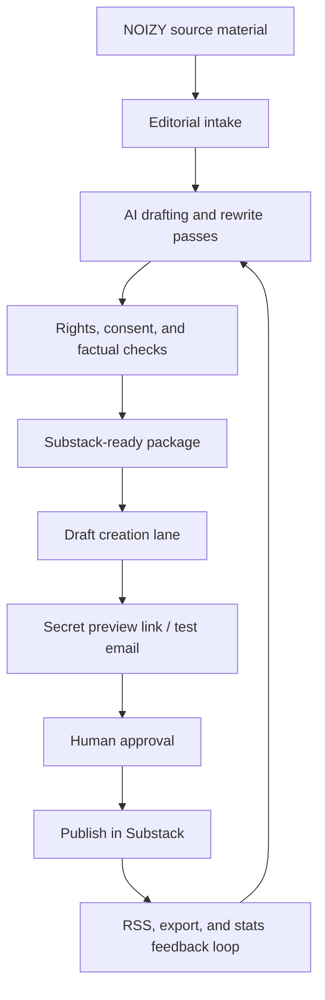

# NOIZY Substack Agentic Publishing Blueprint

Research date: 2026-06-16

This replaces the earlier "zero-friction Substack automation" idea with a safer, smarter operating model.

The goal is not to blindly automate Substack. The goal is to make the NOIZY publishing pipeline agentic while keeping publication, subscriber access, payment visibility, and account security under human control.

## Executive Read

Substack should be treated as the public distribution layer, not the source of truth.

Recommended source of truth:

```text
Obsidian / Git / NOIZY content repo
  -> AI editorial pipeline
  -> compliance and consent checks
  -> Substack draft or manual editor handoff
  -> human review
  -> publish
  -> RSS/stats/export feedback loop
```

Do not start with cookie-scraping automation for direct post creation. It is fragile, security-sensitive, and likely to break when Substack changes its internal web app.

## Corrections To The Pasted Plan

### 1. "Substack lacks an official API" is no longer precise

Substack now publishes Developer API Terms, last updated January 8, 2026. The terms describe access to Substack APIs and point to a support article for API-key documentation. That support article currently requires sign-in.

Important limitation: the public API terms describe "Authorized Data" as public creator/publication/profile information. They do not, from the public terms alone, prove there is a supported post-publishing API.

Operational conclusion:

- Use official API access only for permitted public-data/discovery/analytics use cases until the signed-in docs prove more.
- Do not assume official API support for automated post publishing.

### 2. "Email ingestion bridge" is plausible but not verified from current official docs

The pasted plan claims Substack can draft posts through a private publishing email. I did not find current official Substack support documentation confirming this workflow.

Operational conclusion:

- Treat publish-by-email as unverified until confirmed inside the actual Substack dashboard.
- If the dashboard exposes a private post-by-email address, use it only to create drafts, not to auto-publish.

### 3. "Unofficial MCP server" belongs in a sandbox lane

There are unofficial tools and wrappers around Substack. Some use cookies or reverse-engineered endpoints. These can be useful for personal tooling, but they should not be the production backbone for NOIZY publishing.

Operational conclusion:

- Unofficial Substack MCP/browser automation can be tested in a sandbox.
- Never store session cookies in a repo.
- Never allow an agent to publish directly without human confirmation.

### 4. Native Substack media features are stronger than the pasted plan suggests

Official Substack docs confirm strong podcast and video paths:

- Publications have RSS feeds at `https://your.substack.com/feed`.
- Podcast publishing supports MP3, WAV, and AAC.
- Podcast episodes can get AI-generated transcripts.
- Video posts can generate transcripts, create clips, expose audio to a podcast RSS feed, and support paid/free preview behavior.
- Exports include posts, subscribers, and related stats.

Operational conclusion:

- For NOIZYVOX/FISHMUSICINC/DREAMCHAMBER, Substack is valuable as a multimedia distribution node, not just a text newsletter.

## Target Architecture



## Lanes

### Lane A: Official and Safe

Use this first.

- RSS feed monitoring for published-post ingestion.
- Manual or semi-manual editor handoff for drafts.
- Secret draft links and test emails for review.
- Export zip as backup and analytics input.
- Podcast/video tools for audio, video, transcripts, clips, and podcast RSS.
- Official API only where permitted by signed-in API docs.

### Lane B: Assisted Drafting

This is the best near-term productivity lane.

Inputs:

- Obsidian notes
- Git Markdown briefs
- transcript files
- audio recovery catalog highlights
- brand doctrine

Outputs:

- `draft.md`
- `substack-title-options.md`
- `email-subject-lines.md`
- `notes-posts.md`
- `audio-show-notes.md`
- `fact-check.md`
- `approval-checklist.md`

The agent can generate everything needed for the Substack editor without owning the publish button.

### Lane C: Browser Automation Sandbox

Use only if a real workflow demands it.

Allowed:

- Open Substack dashboard.
- Paste prepared draft into the editor.
- Fill metadata fields.
- Generate a preview link.
- Stop before publish.

Disallowed by default:

- Publish now.
- Email subscribers.
- Change payment settings.
- Export subscriber data to unapproved storage.
- Store cookies, session ids, or private draft links in git.

### Lane D: Unofficial API/MCP Experiment

Use only after a security review.

Possible tools:

- Unofficial Substack content APIs for owned publication reads.
- TypeScript libraries that use `substack.sid` cookie authentication.
- Custom local MCP server wrapping safe read-only operations.

Minimum controls:

- Local-only secrets.
- Read-only mode by default.
- Explicit allowlist of operations.
- No auto-publish.
- Logs scrubbed of cookies, subscriber emails, and private preview links.

## NOIZY Publishing Data Model

Each post should have a local manifest:

```json
{
  "id": "noizy-2026-06-16-example",
  "brand": "NOIZY.AI",
  "section": "DREAMCHAMBER",
  "status": "draft",
  "title": "Example Title",
  "subtitle": "Example subtitle",
  "audience": "everyone",
  "send_email": false,
  "assets": [],
  "sources": [],
  "rights": {
    "voice_consent_checked": true,
    "music_rights_checked": true,
    "image_rights_checked": true
  },
  "review": {
    "fact_check_complete": false,
    "human_approved": false
  }
}
```

## Smart Workflow

### 1. Intake

Create a local package:

```text
posts/YYYY-MM-DD-slug/
  manifest.json
  draft.md
  sources.md
  assets/
  review.md
```

### 2. AI Editorial Passes

Run separate passes instead of one giant prompt:

1. Structure pass
2. Voice pass
3. Fact-check pass
4. Legal/rights pass
5. Substack formatting pass
6. Social/Notes extraction pass
7. Podcast/video adaptation pass

### 3. Substack Handoff

Preferred:

- paste into Substack editor manually or with browser automation
- create preview link
- send test email
- human confirms publish settings

### 4. Feedback Loop

Use RSS and exports to build a local performance database:

- published URL
- title
- date
- section
- open/click metrics where exported or manually available
- comments/likes/shares where available
- generated learning notes

## Decision Matrix

| Need | Best method | Risk |
|---|---|---|
| Read published posts | RSS feed | Low |
| Back up owned publication | Substack export | Low |
| Track high-level stats | Export/manual stats capture | Low |
| Draft long-form posts | Local AI pipeline | Low |
| Create Substack draft | Manual paste or browser automation | Medium |
| Publish automatically | Avoid by default | High |
| Use unofficial cookie API | Sandbox only | High |
| Manage subscribers | Official dashboard/export only | High |

## Implementation Plan

### Phase 1: Local Source Of Truth

Build:

- `ops/substack-agentic-publishing/posts/`
- manifest schema
- draft generator prompt
- review checklist

### Phase 2: Read-Only Integrations

Build:

- RSS importer
- export parser
- post-performance database
- source citation tracker

### Phase 3: Draft Handoff

Build:

- Substack-ready Markdown/HTML exporter
- title and subject-line generator
- preview checklist
- browser automation that stops at preview

### Phase 4: Multimedia NOIZY Lane

Build:

- podcast show-note generator
- transcript cleaner
- clip/social extract generator
- audio rights checklist using NOIZY consent doctrine

### Phase 5: Experimental MCP

Only after Phases 1-4:

- read-only MCP server for RSS/export database
- optional sandbox Substack browser automation tools
- no direct publish tool unless explicitly approved per run

## Security Rules

1. Never commit Substack cookies.
2. Never commit subscriber exports.
3. Never expose private draft links in public logs.
4. Never auto-email the list.
5. Never auto-publish paid content.
6. Never upload audio/video without rights and consent checks.
7. Keep the source-of-truth copy outside Substack.

## Research Sources

- Substack Developer API Terms: https://substack.com/api-tos
- Substack RSS support: https://support.substack.com/hc/en-us/articles/360038239391-Is-there-an-RSS-feed-for-my-publication
- Substack export support: https://support.substack.com/hc/en-us/articles/360037466012-How-do-I-export-my-posts
- Substack publish flow: https://support.substack.com/hc/en-us/articles/360037831771-How-do-I-publish-a-new-post-on-Substack
- Substack preview/test links: https://support.substack.com/hc/en-us/articles/360038433692-How-do-I-share-a-preview-of-my-post-with-others
- Substack metrics guide: https://support.substack.com/hc/en-us/articles/5320347155860-A-guide-to-Substack-metrics
- Substack podcast support: https://support.substack.com/hc/en-us/articles/360037462092-How-do-I-create-and-publish-a-podcast-on-Substack
- Substack video posts: https://support.substack.com/hc/en-us/articles/21093671091220-Guide-to-video-posts-on-Substack
- Unofficial SubstackAPI project: https://github.com/Noah-Bjorner/SubstackAPI
- Unofficial TypeScript Substack API docs: https://substack-api.readthedocs.io/

## Bottom Line

The A-game version is not a brittle "AI controls Substack" hack.

The A-game version is a NOIZY publishing command center:

- local source of truth
- AI editorial intelligence
- consent and rights gates
- Substack draft handoff
- human publish control
- RSS/export/stats feedback loop
- optional sandbox automation only where it earns its risk
