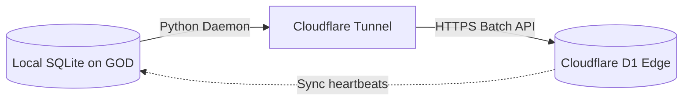

# 🔄 NOIZY SYNC MAP & TOPOLOGY
**PROTOCOL:** SYNC ARCHITECTURE | **AUTHORITY:** ENGR_KEITH

This document details the synchronization logic between local SQLite databases and the Cloudflare D1 cloud edge.

---

## 🗺 Synchronization Flow

## Replication Mechanics

* **Offline-First Storage**  
  All active transactions, consent checks, and audio tags write directly to local SQLite on the M2 Ultra Mac Studio (`GOD.local`) first. Local operation has zero network dependency.

* **Replication Daemon**  
  A local Python service monitors the SQLite write-ahead log (WAL) or triggers on database events. Writes are batch-queued and sent via a secure Cloudflare Tunnel to the Cloudflare D1 edge database (`gabriel_db`).

* **Failover Protocol**  
  If the network is offline:
  1. Writes queue locally.
  2. The edge worker falls back to read-only mode or authenticates using local signatures.
  3. Upon network restoral, the daemon plays back the queued transaction stream in order.
