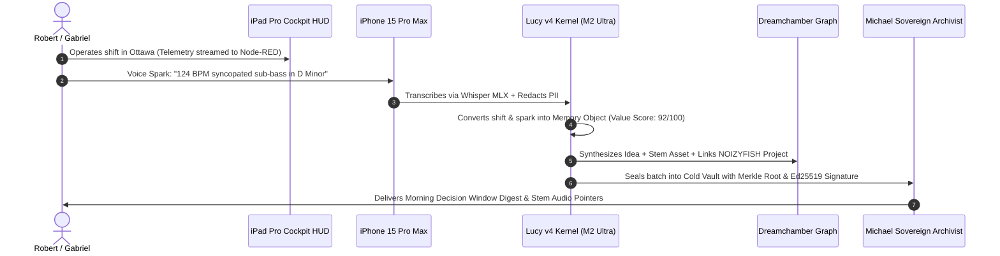

# 🜂 NOIZY MOBILE — CANONICAL DEMO & PRODUCTION NETWORK

> **Sovereign Fleet Specification: M2 Ultra (God Rig) ↔ iPhone 15 Pro Max ↔ iPad Pro 2nd Gen ↔ Michael (MBP 2012)**  
> **Architect:** Robert Stephen Plowman — The DreamChamber  
> **Status:** Live & Production Ready · August 2026

---

## 1. Network Topology & Node Roles

```
┌──────────────────────────┬─────────────────┬───────────┬────────────────────────────────────────────────────────┐
│ Device                   │ Tailscale Mesh  │ Local Port│ Core Subsystem Role                                    │
├──────────────────────────┼─────────────────┼───────────┼────────────────────────────────────────────────────────┤
│ **M2 Ultra God Rig**     │ `100.118.84.40` │ `:11434`  │ Local Ollama 72B & Kimmy 3 Multimodal Engine           │
│ (192 GB Unified Memory)  │                 │ `:5678`   │ n8n Macro Automation Spine                             │
│                          │                 │ `:1880`   │ Node-RED Real-Time Telemetry & WebSocket Engine        │
│                          │                 │ `:7777`   │ Dreamchamber UI & Knowledge Graph                      │
│                          │                 │ WORM      │ Michael 12TB Cold Legacy Vault (Signed Merkle Roots)   │
├──────────────────────────┼─────────────────┼───────────┼────────────────────────────────────────────────────────┤
│ **iPhone 15 Pro Max**    │ `100.96.243.95` │ Gateway   │ 5G Cellular Hotspot Tether & Mesh Gateway              │
│                          │                 │ Webhook   │ Gabriel Voice Trigger & Biometric Decision Auth Gate   │
├──────────────────────────┼─────────────────┼───────────┼────────────────────────────────────────────────────────┤
│ **iPad Pro 12.9" Gen 2** │ `100.90.133.90` │ Web PWA   │ In-Car Lucy v4 Cockpit HUD (120Hz ProMotion Retina)    │
│ (iPadOS 17.7 Second Life)│                 │ `:1880/ui`│ Real-Time Telemetry Gauges, Live Zone Staging Map      │
├──────────────────────────┼─────────────────┼───────────┼────────────────────────────────────────────────────────┤
│ **Michael (MBP 2012)**   │ `100.88.102.10` │ VNC :5900 │ macOS Sequoia (OCLP) Dedicated Archival Node           │
│                          │                 │ SSH :22   │ Remote Screen Sharing & Secondary Storage Controller   │
└──────────────────────────┴─────────────────┴───────────┴────────────────────────────────────────────────────────┘
```

---

## 2. Real-Time In-Car Cockpit Workflow

### Step 1: Fleet Wakeup
On the M2 Ultra God Rig (or automatically on login):
```bash
./start-empire-stack.sh
```

### Step 2: Cellular Tethering & iPad Connection
1. **iPhone:** Settings $\to$ Personal Hotspot $\to$ Turn ON **"Allow Others to Join"** and **"Maximize Compatibility"**.
2. **iPad Pro:** Connect Wi-Fi to iPhone $\to$ Open Safari $\to$ Navigate to:
   - **Cockpit HUD:** `http://100.118.84.40:1880/` (or local PWA at [`ui/cockpit.html`](file:///Users/m2ultra/THE-GATHERING/ui/cockpit.html))
   - **VS Code Web Remote:** `https://vscode.dev/tunnel/god-rig-m2ultra/Users/m2ultra/THE-GATHERING`

### Step 3: Real-Time Operational Staging
The iPad HUD displays live Ottawa zone scoring calculated via:
$$S(z, t) = 0.35 V_{\text{rev}} + 0.25 M_{\text{surge}} + 0.20 I_{\text{event}} + 0.15 D_{\text{lang}} - 0.05 P_{\text{frict}}$$

* **ByWard Market:** Friday midnight nightlife surge staging.
* **YOW Airport:** Live flight arrival waves without congestion delays.
* **Lansdowne:** Major sports/concert let-out windows.

---

## 3. End-to-End Shift Pipeline (Experience → Knowledge → Wisdom → Legacy)



---

## 4. Maintenance & Single-Command Operations

| Operation | Command |
|---|---|
| **Live Ottawa Zone Score** | `./lucy.sh score` |
| **Shift Memory Object Ingestion** | `./lucy.sh ingest` |
| **Dreamchamber Graph Synthesis** | `./lucy.sh graph` |
| **Michael Merkle Archival Batch** | `./lucy.sh archive` |
| **Gabriel Digital Twin Query** | `./lucy.sh twin "Prompt"` |
| **Run Full Smoke Test Suite** | `./lucy.sh test` |
| **Launch Entire Fleet Stack** | `./start-empire-stack.sh` |
| **iPhone Hotspot Setup & Diagnostics** | `./scripts/setup-iphone-hotspot.sh` |
| **Connect to Michael via Screen Sharing** | `./scripts/connect-michael-ard.sh` |
| **Build Sequoia USB for Michael** | `./scripts/create-sequoia-mbp2012-usb.sh` |

---
*NOIZY.AI — The DreamChamber Sovereign Architecture.*
