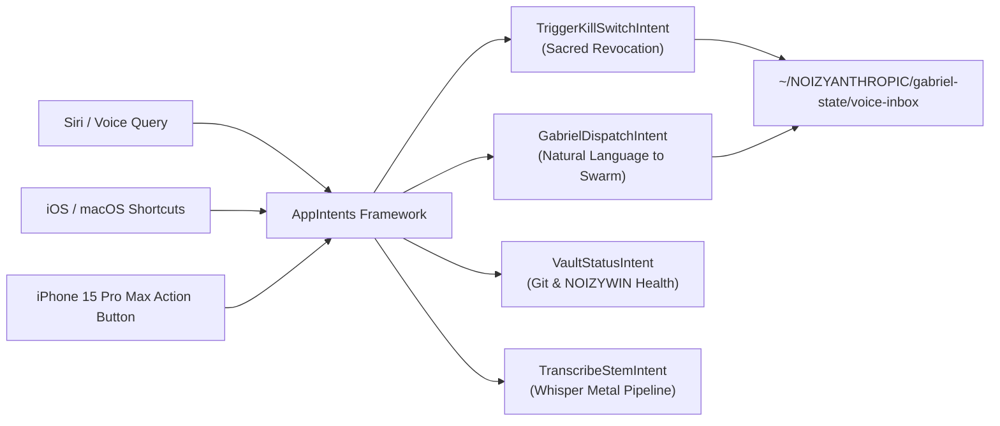

# 🎙️ CURSORLESS OPEN SOURCE & APPLE APP INTENTS
**Vocal Code Refactoring & Native Siri / Shortcuts / Action Button Control**  
*Apple Mac Studio M2 Ultra · iPhone 15 Pro Max · iPad Pro · NOIZYWIN*  
*Date: 2026-09-24 · Author: RSP_001 / NOIZYVAULT*

---

## 1. Cursorless Open Source (`cursorless-talon`)

**Status:** Restored from `origin/main` ([cursorless-dev/cursorless-talon](https://github.com/cursorless-dev/cursorless-talon.git)) and linked to `pokey.cursorless` in Visual Studio Code Insiders.

### Core Spoken Grammar Primer
Cursorless operates on **Decorated Marks** (colored hats on characters) and **Syntactic Scopes**:

```text
"take air"         → Select token with 'a' hat
"change funk"      → Change entire containing function
"chuck blue whale" → Delete token marked with blue 'w' hat
"post red line"    → Insert cursor after line marked with red hat
"swap air with bat"→ Swap tokens 'a' and 'b'
"pour line"        → Insert line below and position cursor
"drink line"       → Insert line above and position cursor
```

### File Hierarchy on Mac Studio M2 Ultra
* **Grammar Root:** `~/.talon/user/cursorless-talon/`
* **Custom Overrides:** `~/.talon/user/cursorless-settings/` (CSV action mappings, hats, and spoken forms)
* **IDE Extension:** `pokey.cursorless` (VS Code / Antigravity IDE)

---

## 2. Apple App Intents Framework (`NOIZY_AppIntents.swift`)

**Status:** Implemented in [`apps/noizy-intents/NOIZY_AppIntents.swift`](file:///Users/m2ultra/Library/CloudStorage/apps/noizy-intents/NOIZY_AppIntents.swift) and mirrored to `CODE_EVAC/iPad-App/` on `/Volumes/NOIZYWIN`.

### Implemented Intents & Capabilities



| Intent Class | Voice Phrase (Siri) | Hardware Trigger | Target Action |
| :--- | :--- | :--- | :--- |
| **`TriggerKillSwitchIntent`** | *"Hey Siri, trigger NOIZY kill switch"* | Action Button long-press | Immediately revokes vocal licenses; halts sync |
| **`GabrielDispatchIntent`** | *"Hey Siri, ask GABRIEL to [prompt]"* | Lock Screen Widget | Dispatches voice payload to GABRIEL local inbox |
| **`VaultStatusIntent`** | *"Check NOIZYVAULT status"* | Spotlight / Control Center | Verifies Git single source of truth & NOIZYWIN |
| **`TranscribeStemIntent`** | *"Transcribe latest recording"* | Back Tap / Siri Shortcut | Launches local GPU Metal Whisper transcription |

---

## 3. How to Deploy to iPad Pro & iPhone 15 Pro Max

1. Open Xcode project at `CODE_EVAC/iPad-App/` or drag `NOIZY_AppIntents.swift` into your active Xcode Workspace.
2. Ensure Target Membership is checked for:
   * **Main App Target** (iOS / iPadOS)
   * **App Extension Target** (if compiling an Intent Extension or Widget)
3. Under **Signing & Capabilities**, enable:
   * `Siri`
   * `Background Modes` (Remote notifications, Audio, Background fetch)
4. Build & Run to Device (`Cmd + R`).
5. Open the **Shortcuts app** on iPhone or iPad: the NOIZY actions will immediately appear under the application section and in the Action Button configuration menu!
