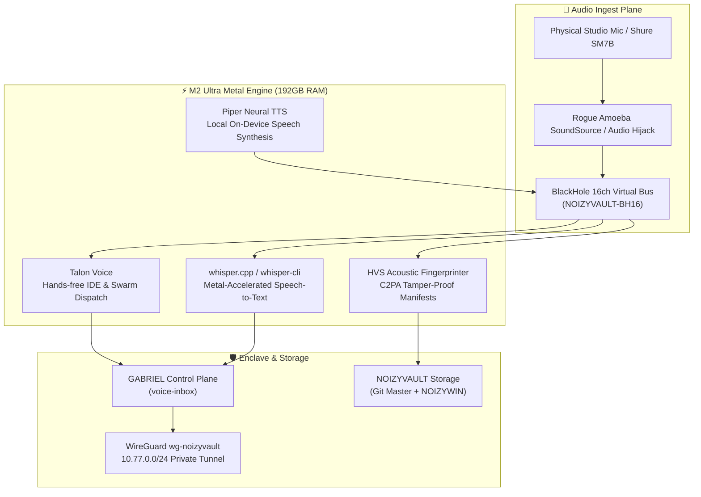

# 🎙️ FOSS VOICE STACK ARCHITECTURE
**On-Device Speech-to-Text, Neural Synthesis, Talon Hands-Free & HVS Sovereignty**  
*Apple Mac Studio M2 Ultra (192GB) · NOIZYWIN · WireGuard Enclave*  
*Date: 2026-09-24 · Author: RSP_001 / NOIZYVAULT*

---

## 1. Zero-Cloud Voice Architecture



---

## 2. Component Directory & Executables

| Component | License | Binary / Path | Function & M2 Ultra Acceleration |
| :--- | :--- | :--- | :--- |
| **Whisper Metal** | MIT | `/opt/homebrew/bin/whisper-cli` | On-device STT; uses M2 Ultra 173GB Metal neural memory |
| **Piper TTS** | MIT | `uv run --with piper-tts` | Ultra-fast local neural voice generation; zero latency |
| **Talon Voice** | FOSS Userland | `~/.talon/user/noizy/` | System voice grammar, app launcher, Gabriel dispatch |
| **BlackHole 16ch** | GPLv3 | CoreAudio Virtual Driver | Zero-latency internal 16-channel audio routing matrix |
| **FFmpeg** | GPL/LGPL | `/opt/homebrew/bin/ffmpeg` | Audio stem slicing, sample rate conversion, spectral analysis |
| **HVS Engine** | Sovereign | `scripts/foss_hvs_fingerprint.py` | SHA-256 acoustic hashing & C2PA manifest generation |

---

## 3. Talon Voice Commands (`noizy_voice_master.talon`)

| Spoken Phrase | Action Triggered | Destination |
| :--- | :--- | :--- |
| `"gabriel listen"` | Engages voice listening mode in GABRIEL | `voice-inbox/intent-*.json` |
| `"gabriel briefing"` | Triggers autonomous morning health briefing | Local Agent Swarm |
| `"lucy triage"` | Executes Gmail / calendar intake triage | Lucy Engine |
| `"whisper transcribe last"`| Runs Metal Whisper on the most recent recording | Generates `.txt` and `.json` |
| `"piper say <phrase>"` | Generates neural speech locally | BlackHole 16ch / Speaker |
| `"vault status"` | Desktop notification of vault & NOIZYWIN status | Notification Center |
| `"kill switch trigger"` | **Instant Sacred Revocation:** suspends active licenses | HEAVEN Kernel |

---

## 4. Quick Execution Runbook

### Transcribe an Audio Stem (Metal-Accelerated)
```bash
python3 /Users/m2ultra/Library/CloudStorage/scripts/foss_whisper_transcribe.py stem.wav
```

### Synthesize Speech Locally (Piper)
```bash
python3 /Users/m2ultra/Library/CloudStorage/scripts/foss_piper_speak.py --text "Welcome to the MC96ECO Universe."
```

### Fingerprint Audio for HVS & C2PA
```bash
python3 /Users/m2ultra/Library/CloudStorage/scripts/foss_hvs_fingerprint.py master_voice.wav --creator RSP_001
```
