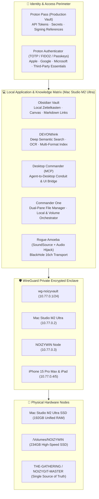

# 🏛️ NOIZYVAULT LOCAL SOVEREIGNTY STACK
**Sovereign Hardware, Local Applications, Identity & Encrypted Mesh Blueprint**  
*Apple Mac Studio M2 Ultra (192GB) · NOIZYWIN (Windows 11) · iPad / iPhone Fleet*  
*Date: 2026-09-24 · Author: RSP_001 / Co-Architect Pass*

---

## 1. Executive Topology & Boundaries

---

## 2. Local Applications Matrix

| Application | Role in NOIZYVAULT | Local Path / Mount | Integration Mechanism |
| :--- | :--- | :--- | :--- |
| **NOIZYVAULT** | Sovereign asset, C2PA provenance & audio conduit | `/Users/m2ultra/Library/CloudStorage` | WireGuard + C2PA + BlackHole 16ch |
| **Obsidian** | Local markdown second brain & live thinking | `~/Library/CloudStorage/docs` | Git-backed vault; zero proprietary lock-in |
| **DEVONthink** | AI semantic search, OCR & archival repository | `~/Library/Application Support/DEVONthink` | Indexes all `.docx`, `.pdf`, `.gdoc`, `.json` |
| **Desktop Commander** | Agent desktop bridge & file preview MCP | `DesktopCommanderMCP` | MCP server allowing LLMs structured system access |
| **Commander One** | Pro dual-pane file management & drive sync | `/Applications/Commander One.app` | Pane A: Local Git repo $\leftrightarrow$ Pane B: `/Volumes/NOIZYWIN` |
| **Rogue Amoeba** | Deterministic studio audio bus & routing | Audio Hijack + SoundSource | BlackHole 16ch (`NOIZYVAULT-BH16`) |

---

## 3. Proton Pass & Proton Authenticator Perimeter

> [!IMPORTANT]
> **Zero Flat-File Secret Leaks:** Raw API secrets, service keys, and private signing credentials are never stored plaintext in Git. Proton Pass acts as the single authoritative vault.

### 🔑 Authentication Matrix (M2M APIs vs. Proton Authenticator 2FA)

| Tier / Ecosystem | Human Interactive Auth (Proton Authenticator) | Machine / API Token (Proton Pass $\rightarrow$ `.env`) |
| :--- | :--- | :--- |
| **Apple** | Apple ID 2FA, Apple Developer Program, App Store Connect | App-Specific Passwords, App Store Connect API Key |
| **Google** | Google Workspace Super Admin (`rp@fishmusicinc.com`), Cloud Console | Google Cloud Service Account JSON, OAuth Client Secrets |
| **Microsoft** | Microsoft 365 Admin, Entra ID (Azure AD), MFA | Entra ID Client Secret, Phi-4 RBAC Service Principal |
| **Cloudflare** | Cloudflare Dashboard 2FA / Passkey | Fine-grained API Token (Workers, D1, KV, DNS) |
| **GitHub** | GitHub 2FA (FIDO2 / TOTP) | Fine-grained Personal Access Token (PAT), Deploy Keys |
| **Payment & Infrastructure** | Stripe Dashboard 2FA, GoDaddy/NS1 Registrar 2FA | Stripe Restricted API Keys, NS1 API Key |
| **AI Models & Voice** | Anthropic, OpenAI, ElevenLabs web login 2FA | `ANTHROPIC_API_KEY`, `OPENAI_API_KEY`, `ELEVENLABS_API_KEY` |

---

## 4. WireGuard Mesh Configuration (`wg-noizyvault`)

* **Private Subnet:** `10.77.0.0/24`
* **Port:** `51820/udp` (or internal NAT traversal)
* **Keepalive:** `25s` for mobile peers (iPhone / iPad)

### Peer Allocations
* `10.77.0.1` — **NOIZYVAULT Gateway / Hub**
* `10.77.0.2` — **Mac Studio M2 Ultra** (Control Plane & Inference Engine)
* `10.77.0.3` — **NOIZYWIN** (`/Volumes/NOIZYWIN`, Windows 11 Node)
* `10.77.0.4` — **iPhone 15 Pro Max** (`NOIZYMOBILE` / Uber Driver Boss)
* `10.77.0.5` — **iPad Pro** (`NoizyLabDashboard_HOTROD.swift` / `StillHereServer` Client)

---

## 5. Operational Invariants

1. **Stateful Single Source of Truth:**
   The cloud git repository (`THE-GATHERING / NOIZYGIT-MASTER`) and the local physical mirror (`/Volumes/NOIZYWIN`) form the immutable backbone. If any ephemeral folder is wiped, `git pull` on the M2 Ultra immediately restores the entire operational environment.
2. **Deterministic Audio Routing:**
   BlackHole 16ch channels 1–2 are local operator monitor; channels 3–4 require signed consent before recording; channels 5–6 route DreamChamber synthesis.
3. **Provable Provenance:**
   C2PA sidecars attach strictly to finalized exported masters and stems, cryptographically binding human creator authorship.
