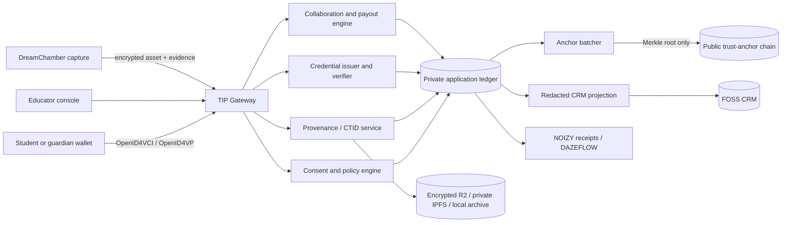

# PLOWMAN STANDARD — TIP + Verifiable Learning Technical Specification

> **Wisdom Keepers Music School · WIZDOM · NOIZYKIDZ · DreamChamber**
> **Document ID:** `WIZ-TIP-001`
> **Version:** `0.1.0`
> **Status:** Draft for architectural, privacy, and governance approval
> **Authority:** Robert Stephen Plowman (`RSP_001`)
> **Created:** 2026-09-13
> **Canonical repository:** `RSPNOIZY/THE-GATHERING`
> **Review cadence:** Every 90 days and before any production pilot

> **Proof before promise. Consent before capture. A child never becomes the product.**

---

## 1. Purpose

This specification defines a consent-native, provenance-first learning and creative-rights system for Wisdom Keepers Music School. It combines:

- the **Trust Identity Protocol (TIP)** application profile defined here;
- W3C Decentralized Identifiers and Verifiable Credentials;
- C2PA Content Credentials for media provenance;
- post-quantum-capable identity proofs using NIST FIPS 204 ML-DSA-65;
- a private application ledger with publicly verifiable Merkle checkpoints;
- encrypted, content-addressed media storage;
- human-ratified collaboration and compensation records; and
- a vendor-neutral FOSS CRM boundary.

The goal is durable student agency. A student must be able to leave the school with independently verifiable credentials, provenance records, and creative history without depending on a proprietary school database.

This document is an implementation contract. Product copy, legal advice, token issuance, speculative economics, and selection of a production public chain are outside its authority.

### 1.1 Normative language

The words **MUST**, **MUST NOT**, **REQUIRED**, **SHALL**, **SHALL NOT**, **SHOULD**, **SHOULD NOT**, and **MAY** are normative requirements.

### 1.2 Standard versus profile

TIP is a **NOIZY application profile**, not a ratified internet standard and not a new DID method. Implementations MUST describe it as “the Trust Identity Protocol profile” until it has an independent specification, interoperability suite, governance process, and public registry.

TIP composes existing standards. It MUST NOT redefine DID, VC, C2PA, OAuth, or blockchain terminology when an established term already exists.

---

## 2. Plowman laws

These requirements are inherited from the repository doctrine and are not optional feature flags.

| Law | System requirement |
|---|---|
| Consent as executable code | Every capture, disclosure, credential issuance, collaboration split, and payout MUST have a valid, scoped consent authorization. |
| Provenance as default | Every accepted learning artifact MUST produce a CTID record and a C2PA-compatible provenance manifest or an explicit failure receipt. |
| Revocation as sacred | Keys, credentials, consent grants, and access capabilities MUST be revocable without rewriting historical evidence. |
| Compensation as automatic | A ratified split MUST produce deterministic payout instructions and an append-only receipt. |
| No silent execution | Every success and every failure MUST emit exactly one canonical `NOIZYReceipt`. |
| Creator protection | The creator pool MUST be at least 75% wherever the 75/25 Creator Covenant applies. |
| NOIZYKIDZ trust | The 1% NOIZYKIDZ contribution MUST come from the platform share and MUST NOT reduce the creator pool. |
| Human authority | Classifiers and contribution metrics advise. Humans authorize origin claims, splits, disputes, and publication. |
| Child protection | No child PII, global identifier, biometric template, media pointer, wallet address, or behavior profile may be written to a public ledger. |
| History keeps the scar | Corrections append a superseding event. Historical rows, receipts, and anchors are never edited into a false clean history. |

The existing NOIZYKIDZ Never Clauses remain controlling. In particular, the implementation MUST minimize child data, MUST NOT sell or disclose it to third parties, MUST NOT monetize a child, and MUST preserve moment-by-moment opt-in participation.

---

## 3. Scope

### 3.1 In scope

- student, guardian, educator, school, and verifier identity relationships;
- pairwise and portable identifiers;
- key creation, rotation, recovery, suspension, and revocation;
- provenance for audio, video, project files, stems, assignments, and performances;
- origin claims for human, assisted, generated, mixed, and unknown work;
- course, badge, diploma, and skill credential issuance and verification;
- selective disclosure and minimal-data verification;
- collaborative credit, consented split agreements, disputes, and corrections;
- encrypted object storage, private content addressing, fixity, and archival export;
- private application-ledger events and public batch anchors;
- FOSS CRM projection and synchronization;
- accessibility, security, privacy, observability, and conformance gates.

### 3.2 Out of scope for version 1

- cryptocurrency, tradable tokens, staking, yield, or public token sales;
- autonomous determination of copyright ownership;
- automatic royalty allocation from spectral presence or stem duration alone;
- publication of student portfolios by default;
- biometric identity proofing;
- permanent public-chain storage of student records;
- a custom `did:tip` method;
- production use of draft SD-JWT VC or experimental zero-knowledge systems without a separate approval gate;
- replacement of the school’s statutory records, safeguarding duties, or accounting system;
- legal conclusions about securities, tax, copyright, privacy, or capacity to contract.

---

## 4. Truth boundaries

The system MUST communicate what each proof establishes and what it does not establish.

| Mechanism | It can prove | It cannot prove |
|---|---|---|
| Digital signature | A holder of a private key signed specific bytes. | The signer was physically present, understood the claim, or is legally the named person. |
| Cryptographic hash | The verified bytes match the committed bytes. | Authorship, creative originality, consent, or lawful ownership. |
| Blockchain anchor | A commitment was included no later than a confirmed block and has not been altered in that chain history. | The committed claim was true, fair, lawful, or complete. |
| Acoustic fingerprint | A recording is similar to, or derived from, another recording under a named algorithm and threshold. | Human authorship, copyright ownership, or exact file identity. |
| AI classifier | A model produced a scored inference from declared inputs. | Ground truth or a guarantee of human musicianship. |
| Verifiable Credential | An identified issuer made an integrity-protected claim. | Universal acceptance of the claim or current validity without status checking. |
| Merkle inclusion proof | A leaf belongs to a committed batch. | Zero knowledge by itself, or truth of the leaf’s contents. |

User interfaces MUST show these boundaries in plain language. The words “verified human” MUST NOT be displayed solely because a classifier exceeded a threshold.

---

## 5. System context



### 5.1 Architectural decision

Version 1 SHALL use two logical ledgers:

1. **Private Application Ledger** — the authoritative operational event log for enrollments, consent, CTIDs, credentials, collaborations, disputes, and payout instructions.
2. **Public Trust-Anchor Ledger** — a public or consortium-verifiable chain that receives only non-identifying batch commitments.

The public chain is not the student database. The private ledger is not made trustworthy merely by calling it a blockchain. Integrity comes from signed events, strict policy, append-only storage, independent checkpoints, and verifiable exports.

### 5.2 Deployment recommendation

- **Reference private ledger:** Hyperledger Fabric channel or an equivalently permissioned, independently operated append-only ledger.
- **Reference public anchor:** a mature EVM rollup or other chain selected through a governance and threat-model review.
- **Validium:** permitted only if the data-availability committee, exit path, data escrow, proof verifier, finality policy, and failure recovery are documented and tested. It is not the default because off-chain data availability can prevent independent recovery.
- **Prototype mode:** D1 append-only events plus signed Merkle batches MAY precede Fabric. Prototype receipts MUST be labeled `assurance: experimental` and MUST NOT imply consortium validation.

---

## 6. Actors and authority

| Actor | Authority | Prohibited authority |
|---|---|---|
| Student | Controls disclosure, portfolio publication, and creative approval appropriate to capacity. | Cannot be coerced into public permanence as a condition of learning. |
| Guardian | Provides legally required authorization and recovery participation for a minor. | Does not become the author or owner of the student’s work. |
| Educator | Attests observed learning evidence and proposes collaboration claims. | Cannot unilaterally assign origin, ownership, or payout shares. |
| School issuer | Issues credentials and operates policy services. | Cannot silently rotate a holder key or rewrite historical records. |
| NOIZYKIDZ Council / Guild | Governs schemas, trust policy, and constitutional changes. | Cannot waive Never Clauses. |
| RSP_001 | Final repository authority and emergency revocation authority defined by NOIZY doctrine. | Emergency action MUST still produce a receipt and review record. |
| CRM | Holds operational relationship projections. | Is never the authority for identity, provenance, consent, credentials, or payouts. |
| Classifier | Produces a versioned recommendation and evidence score. | Never signs the final human-origin attestation. |
| External verifier | Requests the minimum necessary claims and verifies cryptographic status. | Receives no undisclosed record or stable child identifier. |

---

## 7. TIP identity profile

### 7.1 Identifier model

TIP uses three identifier layers:

1. `tipSubjectId` — an internal, non-public UUIDv7 used only inside the private trust domain.
2. **Pairwise DID** — a holder-controlled DID unique to a school, verifier, or collaboration relationship.
3. **Portable DID** — optional for an adult or a student transitioning to independent control. It MUST be opt-in and MUST NOT be required for course participation.

`did:tip` MUST NOT be emitted. A standards-track DID method with acceptable privacy, recovery, and key-rotation behavior MUST be selected before production. The implementation MUST abstract DID method operations behind `DidResolver` and `DidController` interfaces.

No public DID document may contain a student’s name, email, age, school, course, disability, guardian relationship, media CID, or stable internal identifier.

### 7.2 Post-quantum signing profile

The TIP cryptographic root SHALL use **ML-DSA-65 as specified by NIST FIPS 204**. Because wallet, browser, DID-method, C2PA, and blockchain support for ML-DSA is not universal, production interoperability SHALL use a hybrid proof:

- an ecosystem-compatible signature selected by the target protocol, such as P-256/WebAuthn; and
- an ML-DSA-65 detached signature over the same canonical challenge.

Both signatures MUST bind:

```text
domain || operation || subject || audience || nonce || issued_at || payload_hash
```

High-assurance verification MUST require both signatures. Compatibility-mode verification MAY accept the ecosystem signature alone only when the response is labeled `TIP-A1` and the policy permits it.

| Assurance | Required evidence |
|---|---|
| `TIP-A0` | Self-asserted identifier; no holder-key proof. Never sufficient for issuance. |
| `TIP-A1` | Holder proof using the protocol-compatible key. |
| `TIP-A2` | `TIP-A1` plus valid ML-DSA-65 signature. |
| `TIP-A3` | `TIP-A2` plus documented, consented human witness or institution enrollment ceremony. |

The system MUST be crypto-agile. Every signature record SHALL include `algorithm`, `parameterSet`, `keyId`, `created`, `canonicalization`, and `suiteVersion`. Algorithm identifiers MUST be versioned constants, not inferred from key length.

### 7.3 Key custody

- Private keys MUST be generated at the holder edge when device capability permits.
- The school MUST NOT retain plaintext student private keys.
- Software-held ML-DSA keys MUST be encrypted at rest using a per-holder key-encryption key.
- Hardware-backed compatible keys SHOULD use WebAuthn/passkeys.
- Recovery MUST rotate to a new key; it MUST NOT silently restore an old compromised signing key.
- Recovery authorization SHOULD require two independent factors or parties. The school alone MUST NOT be sufficient.
- Key export MUST be encrypted, portable, documented, and tested before pilot launch.
- Every key creation, rotation, recovery, compromise, suspension, and revocation MUST append a signed event and receipt.

### 7.4 Minor-to-adult transition

The implementation MUST support a controlled transition from guardian-assisted custody to student-controlled custody:

1. create new holder-controlled keys;
2. obtain the required guardian/school transition attestations;
3. rebind or reissue active credentials to a new pairwise or portable DID;
4. revoke obsolete access capabilities;
5. preserve the old-to-new link privately; and
6. disclose that link only at the holder’s request.

Turning a specified age MUST NOT automatically publish or correlate the student’s historical identifiers.

---

## 8. Content Trust ID (CTID)

### 8.1 Definition

A CTID is a stable identifier for a signed provenance claim about one immutable asset version. It is not an NFT, ownership token, copyright registration, or human-authorship guarantee.

Each changed byte sequence creates a new hard-bound asset version and therefore a new CTID. Derived files SHALL reference ingredient CTIDs rather than replacing their history.

### 8.2 CTID format

```text
urn:ctid:sha3-256:<base64url-no-padding-digest>
```

The digest MUST be computed over an RFC 8785-canonicalized JSON **identity payload** containing only:

```json
{
  "schema": "https://noizy.ai/ns/tip/ctid/v1",
  "subjectDid": "did:example:pairwise-holder",
  "assetDigest": {
    "algorithm": "SHA3-256",
    "value": "base64url-digest"
  },
  "created": "2026-09-13T00:00:00Z",
  "nonce": "base64url-128-bit-random"
}
```

Mutable status, storage locations, classifier results, chain confirmations, and display metadata MUST NOT be part of the CTID identity payload. They SHALL be separately signed assertions referencing the CTID.

### 8.3 Required bindings

Every CTID record MUST contain:

- SHA3-256 of the exact plaintext asset bytes;
- SHA-256 when required for C2PA or ecosystem interoperability;
- media type, byte length, and deterministic hash procedure version;
- an optional, versioned acoustic fingerprint as a C2PA soft binding;
- creator/holder pairwise DID or a privacy-preserving subject commitment;
- consent-grant reference;
- capture-tool and workflow evidence;
- origin attestation and assurance level;
- ingredient CTIDs for derived works;
- C2PA manifest identifier and validation status;
- encrypted storage-descriptor reference;
- private-ledger event identifier;
- public anchor state: `unbatched`, `pending`, `confirmed`, or `failed`;
- one TIP signature set; and
- one canonical NOIZY receipt identifier.

### 8.4 C2PA profile

CTID provenance SHALL use **C2PA Content Credentials 2.4 or a newer version adopted through change control**.

- A hard binding SHALL protect the exact asset.
- A soft binding MAY support discovery of transcoded or metadata-stripped renditions.
- Ingredients SHALL reference source manifests for stems, samples, AI outputs, and earlier versions.
- Custom assertions SHALL use the `ai.noizy.*` namespace.
- A repository receipt SHOULD record ingestion into the school’s manifest repository.
- The C2PA signer certificate, trust list, and validation result MUST be distinguished from the student’s TIP holder proof.
- A C2PA-valid manifest MUST NOT automatically produce origin code `OH`.

### 8.5 Origin codes

| Code | Meaning | Minimum decision rule |
|---|---|---|
| `OH` | Original Human | A human performed/authored the expressive material; no generative model supplied expressive music or performance; instrumented evidence and a human attestation agree. |
| `AA` | AI Assisted | A human remains the expressive author; AI assisted editing, analysis, cleanup, notation, or ideation and the assistance is disclosed. |
| `AG` | AI Generated | Generative output supplies the primary expressive material; human activity is selection, prompting, arrangement, or curation. |
| `MX` | Mixed | Human and generative systems both supplied material expressive contributions represented in the final work. |
| `UN` | Unknown / unresolved | Evidence is missing, contradictory, disputed, or below the policy’s assurance requirement. |

Origin classification MUST follow this flow:

1. capture signed tool and workflow evidence;
2. record all known ingredients;
3. run the classifier and store its model identifier, model digest, configuration, inputs, output scores, and limitations;
4. present the recommendation and evidence to the creator or authorized reviewer;
5. require a human attestation for `OH`, `AA`, `AG`, or `MX`;
6. use `UN` if evidence conflicts or no authorized human can decide; and
7. append any later correction without erasing the prior claim.

The classifier MUST NOT train on student media unless a separate, explicit, revocable training consent exists. Course participation MUST NOT depend on training consent.

---

## 9. Verifiable learning credentials

### 9.1 Standards profile

Production credentials SHALL conform to:

- W3C Verifiable Credentials Data Model 2.0;
- W3C Bitstring Status List 1.0 for privacy-preserving suspension or revocation;
- OpenID for Verifiable Credential Issuance 1.0; and
- OpenID for Verifiable Presentations 1.0.

W3C VC Data Model 2.1 is a Working Draft at this document’s date and MUST NOT replace the 2.0 production profile without a migration decision.

SD-JWT VC remains an IETF Internet-Draft at this document’s date. It MAY be evaluated behind an experimental feature flag, but MUST NOT be the sole production format until the selected version is stable, security-reviewed, and covered by interoperability tests.

### 9.2 Credential types

| Credential | Issuer | Required evidence |
|---|---|---|
| `CourseCompletionCredential` | School | Enrollment, completion policy, educator attestation, status entry. |
| `SkillBadgeCredential` | School or approved educator | Named rubric version, evidence CTID references, assessment date. |
| `MasterclassCredential` | School | Attendance/completion event and instructor signature. |
| `PortfolioCredential` | Student/holder with optional school co-signature | Selected CTIDs only; no hidden school records. |
| `CollaborationCredential` | All ratifying collaborators or governed issuer | Final contribution claims and signed split agreement. |
| `DiplomaCredential` | School | Program requirements, governance approval, and credential status. |

Credentials MUST NOT expose disability, exact age, guardian identity, legal name, or private CTIDs unless that field is necessary for the transaction and explicitly approved.

### 9.3 Selective disclosure

The verifier request MUST identify:

- purpose;
- required claim predicates;
- retention period;
- verifier identity;
- whether onward disclosure is allowed; and
- a nonce and audience.

The wallet MUST show the exact disclosure before consent. “Prove completion” SHOULD disclose a boolean or named credential type, not the student’s marks, media, birth date, or full learning history.

Zero-knowledge range or predicate proofs MAY be added only after:

- the proof system and circuit are versioned;
- trusted-setup requirements are documented;
- verifier and prover libraries pass independent security review;
- proof unlinkability is tested; and
- a non-ZK fallback exists.

The existing Merkle inclusion demonstration is useful for membership proofs but MUST NOT be labeled a zero-knowledge proof.

---

## 10. Private application ledger

### 10.1 Event model

The ledger SHALL be append-only and event-oriented. State views are projections and MAY be rebuilt.

Every event MUST contain:

```json
{
  "eventId": "uuidv7",
  "eventType": "tip.ctid.issued.v1",
  "aggregateId": "opaque-private-id",
  "sequence": 42,
  "occurredAt": "2026-09-13T00:00:00Z",
  "actor": "pairwise-did-or-service-id",
  "payloadDigest": "sha3-256:...",
  "previousEventDigest": "sha3-256:...",
  "policyVersion": "plowman-tip-policy/1",
  "consentGrantId": "opaque-private-id",
  "receiptId": "uuidv7",
  "signatures": []
}
```

Events MAY encrypt their payload separately from their public metadata. Sequence conflicts MUST fail closed and emit a failure receipt.

### 10.2 Corrections

No event may be updated or deleted to conceal history. Corrections MUST append:

- the incorrect event reference;
- the corrected claim;
- reason;
- authorizing actor;
- consent and dispute references;
- effective time; and
- a new receipt.

Operational projections MAY remove access to revoked or erased personal data. The non-identifying historical commitment remains.

### 10.3 Consortium policy

Before production, the private-ledger governance document MUST name:

- node operators;
- endorsement policy;
- schema and smart-contract upgrade threshold;
- incident and expulsion process;
- key rotation and disaster recovery;
- archival export format;
- audit rights; and
- the process for a student to leave with their records.

No single vendor SHOULD operate all endorsing nodes.

---

## 11. Public trust anchoring

### 11.1 Anchor payload

Only a batch commitment SHALL be public:

```json
{
  "schema": "ai.noizy.tip.anchor/v1",
  "batchId": "uuidv7",
  "merkleAlgorithm": "RFC6962-SHA256-v1",
  "root": "base64url-digest",
  "leafCount": 1000,
  "privateLedgerCheckpoint": "opaque-sequence",
  "previousAnchor": "base64url-digest-or-null",
  "created": "2026-09-13T00:00:00Z",
  "issuer": "institution-did",
  "policyVersion": "plowman-tip-policy/1"
}
```

The public payload MUST NOT include a DID belonging to a student, CTID, media CID, course, school relationship, wallet address, name, or event-level timestamp.

### 11.2 Batch construction

- Leaves MUST be domain-separated hashes of canonical private-ledger event envelopes.
- The tree algorithm, leaf prefix, node prefix, ordering, duplicate handling, and odd-node handling MUST be specified and test-vectored.
- A sorted hash list is not a Merkle tree and MUST NOT be presented as one.
- Each holder export MUST include the leaf, sibling path, anchor transaction, chain identifier, contract address, confirmation rule, and verifier instructions.
- Batches MUST be reproducible from an authorized export.

### 11.3 Finality and outages

- An anchor is `pending` until the chain-specific confirmation policy passes.
- Reorganizations MUST return an anchor to `pending` and trigger re-evaluation.
- Chain unavailability MUST NOT block learning or local capture.
- The system SHALL issue a signed provisional receipt, queue the batch, and target confirmation within 24 hours.
- Failure to confirm within 24 hours MUST alert operations and mark affected proofs `degraded`, not `verified`.
- At least one chain-independent signed export MUST remain verifiable if the chosen public chain disappears.

---

## 12. Media and evidence storage

### 12.1 Storage tiers

| Tier | Purpose | Default |
|---|---|---|
| Local creative vault | Active projects and high-fidelity masters | Encrypted storage on GOD.local or approved school device. |
| Object archive | Durable ciphertext, manifests, receipts, exports | Encrypted Cloudflare R2 or equivalent. |
| Content-addressed replica | Portability and distributed verification | Private IPFS cluster or encrypted public IPFS by exception. |
| Public distribution | Holder-approved portfolio renditions only | CDN/IPFS after explicit publication consent. |

IPFS provides content addressing and transport encryption; it does not provide content encryption or hide public DHT metadata. Therefore:

- media MUST be encrypted before it enters IPFS;
- raw child media MUST NOT be placed on the public IPFS network;
- public CIDs MUST NOT be written to the public chain for private assets;
- the retrievable storage descriptor MUST remain encrypted and capability-controlled off-chain;
- the public anchor SHALL commit only to a salted descriptor hash inside a Merkle batch; and
- pinning, retention, deletion, and provider metadata MUST be independently governed.

### 12.2 Encryption profile

- Generate a random data-encryption key per asset version.
- Use an approved AEAD mode such as AES-256-GCM or XChaCha20-Poly1305.
- Bind CTID, media type, byte length, and schema version as authenticated associated data.
- Wrap the data key separately for each authorized holder or group.
- Never reuse a nonce with the same key.
- Store no plaintext key in a database, log, ledger, CRM, analytics event, or C2PA manifest.
- Key destruction MAY implement cryptographic erasure, but the UI MUST explain that third-party copies and historical commitments may remain.

### 12.3 Durability

The 100-year preservation objective requires more than IPFS pinning. The archive SHOULD maintain:

- at least three verified copies;
- at least two storage technologies;
- at least one geographically separate copy;
- scheduled fixity checks;
- documented codec and container migration;
- OAIS/PREMIS preservation metadata;
- periodic key and algorithm migration; and
- a holder-readable export independent of NOIZY services.

---

## 13. Collaboration, attribution, and compensation

### 13.1 Contribution evidence

Stem duration, edit history, session presence, MIDI events, and spectral-presence estimates MAY be captured as evidence. They MUST NOT be treated as ownership percentages.

Spectral or voice features MUST NOT be repurposed as biometric identity templates. Raw analysis MUST remain private, be minimized, and expire according to the project’s retention policy.

### 13.2 Split agreement

A collaboration becomes payable only when:

1. all known contributors are identified or explicitly marked unresolved;
2. every included asset has a valid consent scope;
3. proposed contribution claims and evidence are visible to contributors;
4. percentages use integer basis points and total exactly 10,000;
5. every contributor, or an authorized guardian where required, signs the same agreement digest;
6. the 75% creator-pool floor and 1% NOIZYKIDZ funding law pass; and
7. a cooling-off/dispute window defined by policy closes.

Disagreement MUST suspend the disputed payout portion. Undisputed portions MAY proceed if policy permits. Resolution appends a superseding agreement; it never edits the original.

### 13.3 Life Love Tokens (LLTs)

In version 1, an LLT SHALL be a **non-transferable, non-purchasable, non-tradable receipt unit** representing acknowledged contribution or community participation.

LLTs MUST NOT:

- be marketed as money, an investment, ownership, or a promise of profit;
- have a public exchange, liquidity pool, transferable wallet balance, or sale price;
- replace legal currency in royalty accounting;
- be issued to induce a child to disclose data or continue participation; or
- be deployed as a blockchain token without a separate legal, tax, safeguarding, and governance approval.

Fiat payouts SHALL be calculated from the ratified split agreement and the existing royalty ledger. The LLT record MAY link to a payout receipt but is not the payout.

### 13.4 Economic conformance blocker

The current repository contains a 70% creator floor and a teacher royalty deducted from the student’s share. Those rules conflict with the 75/25 doctrine and require a governed decision before production. This specification does not silently resolve that conflict.

The production gate SHALL fail until:

- the creator floor is consistently 75% where the Creator Covenant applies;
- community/legal/platform subshares are defined inside the remaining 25%;
- the NOIZYKIDZ 1% is demonstrably taken from the platform side; and
- teacher compensation is explicitly consented and cannot undermine the student-protection policy.

---

## 14. “Salesforce FOSS” boundary

### 14.1 Meaning adopted by this specification

“Salesforce FOSS” means **a self-hostable, open-source CRM used as a replaceable operational projection**, not Salesforce’s own open-source developer projects and not a claim that Salesforce CRM is open source.

The CRM manages partner-school contacts, guardian communication preferences, educator workflows, and support cases. It is not part of the cryptographic trust root.

### 14.2 Reference decision

The reference adapter SHOULD target **Corteza** first because its project describes the platform as Apache-2.0 licensed and suitable for specialized CRM workflows. Final selection still requires an SBOM, license scan, accessibility review, backup/restore drill, API test, and maintenance assessment.

Other candidates remain adapters, not architecture commitments:

| Candidate | License posture to verify | Architectural note |
|---|---|---|
| Corteza | Apache-2.0 project | Preferred reference for a strict FOSS boundary and custom workflows. |
| SuiteCRM | AGPL-3.0 | Mature CRM; copyleft obligations and current major-version capability require review. |
| Odoo Community | LGPL-3.0 community edition | Broad ERP surface; enterprise modules are separately licensed and MUST NOT leak into an all-FOSS bill of materials. |
| Twenty | Primarily AGPL/MIT with some commercial-licensed files/features | Modern TypeScript stack, but strict FOSS deployment requires a file-level license and feature-boundary audit. |

Salesforce CodeGen, Lightning Web Components, Salesforce Inspector, and DLRS are separate categories and do not satisfy the requirement for a self-hosted school CRM.

### 14.3 CRM port

All CRM integrations MUST implement a versioned `StudentRelationshipPort` with, at minimum:

```text
upsertRelationshipContact(opaqueSubjectRef, redactedProfile)
recordEnrollmentProjection(enrollmentRef, status, courseRef)
recordCredentialProjection(credentialType, issuedAt, status)
openSupportCase(opaqueSubjectRef, category, consentRef)
recordCommunicationPreference(opaqueSubjectRef, channels, expiresAt)
deleteOrAnonymizeProjection(opaqueSubjectRef, authorityRef)
```

The CRM MUST NOT store:

- private keys or recovery material;
- legal identity unless operationally required and separately protected;
- public or portable student DIDs;
- raw media, media CIDs, acoustic fingerprints, or classifier inputs;
- full credentials or undisclosed claims;
- wallet addresses;
- biometric or disability data; or
- authoritative consent, origin, payout, or ledger state.

Synchronization SHALL use an outbox/event consumer with idempotency keys. The CRM MUST NOT call a smart contract directly. CRM deletion MUST not delete authoritative records; it SHALL request an authorized redaction/anonymization workflow and receive a receipt.

---

## 15. Repository integration map

| Capability | Existing repository evidence | Required change |
|---|---|---|
| Sacred mission and 75/25 law | [`docs/CLAUDE.md`](../../docs/CLAUDE.md) | Treat as policy input; resolve code drift before payouts. |
| NOIZYKIDZ protections | [`DREAMCHAMBER/NOIZYKIDZ/MASTER_NOIZYKIDZ.md`](../../DREAMCHAMBER/NOIZYKIDZ/MASTER_NOIZYKIDZ.md) | Compile NK-1 through NK-5 into policy tests. |
| Universal receipt grammar | [`AGENTS/gabriel/daemon/receipt.js`](../../AGENTS/gabriel/daemon/receipt.js) | Extend receipt schema with subject commitments, policy version, evidence digest, and anchor state. |
| Consent gateway | [`heaven/workers/consent-gateway/`](../../heaven/workers/consent-gateway/) | Add TIP scopes, pairwise subjects, guardian authority, disclosure purpose, and credential revocation. |
| Governance records | [`governance/sql/001_governance_schema.sql`](../../governance/sql/001_governance_schema.sql) | Replace mutable/PII-heavy projections with private event envelopes and redacted views. |
| Revenue and collaboration | [`governance/sql/002_revenue_schema.sql`](../../governance/sql/002_revenue_schema.sql) | Correct the 70/75 conflict, use basis points, consented agreements, and append-only corrections. |
| Royalty engine | [`governance/src/revenue/`](../../governance/src/revenue/) | Add constitutional property tests and minor-safe payout policy. |
| Merkle inclusion prototype | [`tools/verify/zk_inclusion_demo.py`](../../tools/verify/zk_inclusion_demo.py) | Rename as Merkle proof, define a production tree, canonical leaves, and test vectors. |
| Anchor prototype | [`tools/verify/verify_eth_anchor.sh`](../../tools/verify/verify_eth_anchor.sh) | Replace explorer scraping with chain RPC + contract event verification and finality policy. |
| Simplified root verifier | [`tools/verify/verify_merkle_root.sh`](../../tools/verify/verify_merkle_root.sh) | Replace sorted-list hash with the specified production Merkle algorithm. |
| Runtime/object-store plan | [`docs/ARCHITECTURE.md`](../../docs/ARCHITECTURE.md) | Add encrypted evidence buckets, queue-backed anchoring, private IPFS replication, and export service. |
| WIZDOM product boundary | [`wizdom/README.md`](../README.md) | Add contracts, services, schemas, policy, adapters, conformance, and runbooks under `wizdom/`. |

### 15.1 Proposed module layout

```text
wizdom/
  contracts/
    openapi/
    events/
    json-schema/
    contexts/
  services/
    tip-gateway/
    provenance/
    credential-issuer/
    credential-verifier/
    collaboration/
    anchor-batcher/
    export/
  adapters/
    did/
    ledger-fabric/
    anchor-evm/
    storage-r2/
    storage-ipfs/
    crm-corteza/
  policy/
    plowman/
    noizykidz/
  conformance/
    fixtures/
    vectors/
    adversarial/
  runbooks/
  specs/
```

Implementations MAY organize code differently, but these boundaries MUST remain independently testable.

---

## 16. API contract

### 16.1 Protocol rules

- External APIs SHALL use HTTPS and OAuth 2.0/OIDC profiles appropriate to the client.
- Service-to-service calls SHALL use mTLS and short-lived workload identity.
- Mutation requests MUST include `Idempotency-Key`, `TIP-Policy-Version`, and `X-Correlation-ID`.
- Holder proofs MUST include nonce, audience, and expiration.
- Replayed nonces MUST fail closed.
- Authorization MUST evaluate actor, role, subject relationship, purpose, consent scope, age/capacity policy, resource, and requested disclosure.
- Every response MUST include a receipt or a receipt reference.
- Errors MUST be typed and MUST NOT leak private existence or identity information.

### 16.2 Required endpoints

| Verb | Endpoint | Plowman verb | Purpose |
|---|---|---|---|
| `POST` | `/v1/tip/enrollments` | `GOVERN` | Create a private subject and pairwise identity relationship. |
| `POST` | `/v1/tip/keys/rotate` | `GOVERN` | Rotate/recover identity keys with proof and authority. |
| `POST` | `/v1/consents` | `GOVERN` | Grant a scoped, expiring consent. |
| `POST` | `/v1/consents/{id}/revoke` | `GOVERN` | Revoke future authorization immediately. |
| `POST` | `/v1/assets` | `CAPTURE` | Create encrypted upload capability and capture receipt. |
| `POST` | `/v1/ctids` | `CAPTURE` | Register asset digest, evidence, provenance, and CTID. |
| `POST` | `/v1/ctids/{id}/origin-proposals` | `FORGE` | Run a classifier proposal; no final attestation. |
| `POST` | `/v1/ctids/{id}/origin-attestations` | `GOVERN` | Human-ratify or correct an origin code. |
| `POST` | `/v1/credentials/issue` | `GOVERN` | Issue a status-enabled credential. |
| `POST` | `/v1/presentations/verify` | `RECALL` | Verify a minimal presentation and return a redacted result. |
| `POST` | `/v1/collaborations` | `CAPTURE` | Open a collaboration and collect contribution evidence. |
| `POST` | `/v1/collaborations/{id}/ratify` | `GOVERN` | Sign the final split agreement. |
| `POST` | `/v1/collaborations/{id}/dispute` | `GOVERN` | Suspend disputed payout and append a dispute event. |
| `GET` | `/v1/proofs/{receiptId}` | `RECALL` | Return an authorized proof bundle or public redacted proof. |
| `POST` | `/v1/exports` | `ORBIT` | Produce an encrypted, portable holder export. |

### 16.3 Error taxonomy

| Code | HTTP | Meaning |
|---|---:|---|
| `TIP_CONSENT_REQUIRED` | 403 | No valid consent covers the operation. |
| `TIP_CONSENT_REVOKED` | 403 | Consent existed but was revoked. |
| `TIP_HOLDER_PROOF_INVALID` | 401 | Signature, nonce, audience, or key status failed. |
| `TIP_POLICY_DENIED` | 403 | A Never Clause or purpose policy denied the operation. |
| `TIP_IDEMPOTENCY_CONFLICT` | 409 | The same key was reused with a different payload. |
| `TIP_SEQUENCE_CONFLICT` | 409 | Append sequence does not match aggregate state. |
| `TIP_ORIGIN_UNRESOLVED` | 422 | Evidence cannot support a resolved origin code. |
| `TIP_SPLIT_NOT_RATIFIED` | 422 | Required contributor signatures are missing. |
| `TIP_ANCHOR_DEGRADED` | 503 | Private proof exists but public confirmation is overdue. |
| `TIP_DISCLOSURE_EXCESSIVE` | 400 | Verifier requested claims beyond registered purpose. |

Failures MUST produce a receipt without echoing sensitive request content.

---

## 17. Event contract

Required event families:

```text
tip.identity.enrolled.v1
tip.key.rotated.v1
tip.key.revoked.v1
tip.consent.granted.v1
tip.consent.revoked.v1
tip.asset.captured.v1
tip.ctid.issued.v1
tip.origin.proposed.v1
tip.origin.attested.v1
tip.origin.corrected.v1
tip.credential.issued.v1
tip.credential.suspended.v1
tip.credential.revoked.v1
tip.presentation.verified.v1
tip.collaboration.opened.v1
tip.split.proposed.v1
tip.split.ratified.v1
tip.split.disputed.v1
tip.payout.instructed.v1
tip.anchor.submitted.v1
tip.anchor.confirmed.v1
tip.anchor.reorganized.v1
tip.export.created.v1
tip.crm.projected.v1
```

Event schemas MUST reject unknown required-field semantics, permit additive extension fields under a namespaced object, and retain the original schema version forever.

---

## 18. Core data model

| Entity | Key relationships | Authority |
|---|---|---|
| `TipSubject` | has keys, pairwise DIDs, consents, enrollments | Holder relationship service |
| `TipKey` | belongs to subject; supersedes another key | Holder + governed recovery |
| `ConsentGrant` | subject, purpose, resource set, audience, expiry | Consent policy engine |
| `MediaObject` | ciphertext locations, plaintext digest, wrapped keys | Storage service |
| `CtidManifest` | media object, evidence, origin, ingredients | Provenance service |
| `OriginAttestation` | CTID, code, evidence digest, human signer | Authorized human |
| `CredentialRecord` | subject, issuer, schema, status index | Credential issuer |
| `CourseEnrollment` | pairwise subject, course, school | School administration |
| `AssessmentEvidence` | rubric version, CTID refs, educator attestation | Educator + issuer policy |
| `Collaboration` | participants, CTIDs, contribution claims | Collaborators |
| `SplitAgreement` | collaboration, basis points, signatures | All required signers |
| `PayoutInstruction` | split agreement, currency, amount, payee ref | Compensation engine |
| `LedgerEvent` | aggregate, sequence, previous digest | Private ledger |
| `AnchorBatch` | event leaves, root, chain confirmation | Anchor service |
| `CRMProjection` | opaque subject, operational fields | CRM adapter |
| `NOIZYReceipt` | correlation, verb, policy, result, evidence digest | Every command path |

Money MUST use integer minor units plus ISO 4217 currency codes. Shares MUST use integer basis points. Floating-point arithmetic MUST NOT be used for financial settlement.

---

## 19. Security and privacy controls

### 19.1 Required controls

- Threat-model every trust boundary before pilot deployment.
- Use deny-by-default authorization and explicit purpose binding.
- Separate identity, media, credential, ledger, CRM, and analytics encryption domains.
- Prevent stable identifiers from crossing domains unless policy explicitly permits linkage.
- Redact logs by construction; do not rely on cleanup.
- Rate-limit enrollment, proof verification, upload, classification, and credential issuance.
- Use content-type validation, malware scanning, decompression limits, and media parser isolation.
- Sign builds and maintain an SBOM for each deployable service.
- Pin dependency versions and run license and vulnerability scans.
- Support rapid credential, consent, workload, and issuer-key revocation.
- Back up key metadata, status lists, ledger blocks, manifests, and encrypted assets independently.
- Test restoration and holder export, not only backup creation.
- Record privileged access and policy overrides as immutable receipts.

### 19.2 Privacy defaults

- Pairwise identifiers by default.
- No public portfolio by default.
- No classroom ranking, behavioral scoring, or cross-student comparison.
- No training reuse by default.
- No public IPFS for child media.
- No analytics event containing raw prompts, transcripts, audio, DID, or credential payload.
- Shortest practical retention for raw classifier inputs and contribution analytics.
- Separate consent for learning, publication, distribution, model training, and commercial licensing.
- Revoking publication consent MUST remove future publication authorization and initiate unpin/unpublish workflows; it cannot falsify already-issued historical proofs.

### 19.3 Safeguarding gate

Before any child pilot, an accountable human safeguarding lead MUST approve:

- enrollment and guardian authority flows;
- emergency access;
- abuse reporting;
- educator access boundaries;
- retention and deletion schedules;
- cross-border processing;
- payment/custodial handling;
- public portfolio policy; and
- independent incident response.

---

## 20. Threat model

| Threat | Required mitigation |
|---|---|
| Stolen student device | Passkey/device lock, short-lived sessions, remote capability revocation, governed key rotation. |
| School compromise | Pairwise identifiers, payload encryption, threshold issuer control, independent anchor/export verification. |
| Public-chain correlation | Batch roots only, minimum batch size policy, no per-student timing or identifiers. |
| Public IPFS discovery | Private IPFS for child data, client-side encryption, no public CID publication. |
| Classifier false certainty | Human ratification, `UN` fallback, model/version evidence, appeal and correction. |
| Contribution gaming | Multiple evidence sources, no metric-to-share automation, unanimous or governed ratification. |
| Coerced student consent | Granular opt-in, guardian/safeguarding review, non-retaliation, participation without publication/training. |
| Issuer-key compromise | Offline root, short-lived issuing keys, status publication, rotation drill, incident receipts. |
| Ledger administrator rewrite | Multi-operator endorsement, hash chaining, public batch anchors, reproducible exports. |
| Validium data withholding | Avoid by default; otherwise audited DAC, escrow, recovery export, and tested exit path. |
| Chain reorganization | Pending/confirmed states, configurable confirmation threshold, reorg handler. |
| Long-term quantum risk | ML-DSA-65 root proof, algorithm agility, scheduled re-signing and archival migration. |
| CRM breach | Minimal redacted projection, opaque references, no keys/media/credentials, independent deletion. |
| Malicious verifier | Purpose registration, minimum disclosure, nonce/audience binding, consent screen, rate limiting. |

---

## 21. Accessibility and human experience

All core actions MUST work without audio and without color-only meaning.

- Enrollment, consent, disclosure, dispute, recovery, and export MUST have text, symbol, and assistive-technology-compatible paths.
- Haptic and visual confirmations MUST have configurable intensity and a calm default.
- No surprise sounds, forced animation, countdown pressure, or dark patterns.
- Plain-language summaries MUST accompany cryptographic terms.
- A student MUST be able to pause or leave a capture without losing already-saved work.
- High-risk actions MUST use predictable confirmation and provide a review screen.
- Voice control MAY accelerate navigation but MUST NOT be the only authorization factor.
- Interfaces SHOULD be usable by switch control, keyboard-only navigation, screen readers, captions, and reduced-motion settings.

---

## 22. Observability and operations

### 22.1 Service objectives

The pilot SHALL define and monitor:

- consent-revocation propagation target: no more than 60 seconds;
- public-anchor confirmation target: no more than 24 hours;
- zero unreceipted mutation responses;
- zero public-ledger student identifiers or media references;
- zero plaintext media or private-key material in logs;
- 100% credential verification paths checking status;
- 100% payout instructions referencing a ratified split digest; and
- 100% origin attestations carrying evidence and human-authority references.

Availability targets, throughput, and recovery objectives MUST be measured during pilot load testing before production commitments are published.

### 22.2 Runbooks required before pilot

- compromised holder key;
- compromised issuer or service key;
- consent revocation and publication takedown;
- incorrect origin code;
- collaboration dispute;
- payout correction;
- private-ledger outage;
- public-chain outage or reorganization;
- lost IPFS/R2 replica;
- CRM breach;
- minor-data incident;
- full holder export and institutional shutdown.

---

## 23. Conformance and acceptance tests

An implementation is not `PLOWMAN-TIP-v1` conformant until every mandatory test passes.

### 23.1 Identity

- ML-DSA-65 known-answer and negative tests pass against an approved FIPS 204 implementation.
- Hybrid signatures bind identical canonical payloads.
- Replay, wrong audience, expired proof, rotated key, and revoked key fail.
- Pairwise DIDs cannot be correlated from exported public documents.
- Guardian-assisted recovery cannot be completed by the school alone.

### 23.2 Provenance

- Exact-byte modification changes the hard binding and CTID.
- Transcoded media can recover a matching soft-binding candidate without being treated as exact-byte identity.
- Ingredient chains validate and detect missing or altered ingredients.
- C2PA signature validity and TIP origin assurance display separately.
- Classifier-only evidence cannot issue `OH`.
- Conflicting evidence yields `UN`.

### 23.3 Credentials

- W3C VC 2.0 schema and proof validation pass.
- OpenID4VCI and OpenID4VP interoperability tests pass with at least two independent implementations.
- Suspended and revoked credentials fail policy appropriately.
- Selective presentations disclose no extra claims.
- Verifier replay and correlation tests pass.

### 23.4 Ledger and anchor

- Appending, reordering, deleting, or changing an event breaks verification.
- Merkle test vectors cover zero, one, odd, duplicate, and large leaf sets.
- Public anchors contain no prohibited fields.
- Chain reorganization returns confirmations to pending.
- Export verification works without the school API.
- Provisional receipts remain verifiable during chain outage.

### 23.5 Collaboration and economics

- Shares use basis points and total exactly 10,000.
- The creator pool cannot fall below 75% where applicable.
- The NOIZYKIDZ 1% is deducted from the platform side.
- No payout occurs before complete ratification.
- A dispute suspends only the governed amount.
- Corrections append; original agreements remain verifiable.
- LLTs cannot be transferred, purchased, exchanged, or redeemed as currency.

### 23.6 Child safety and accessibility

- Automated scans find no child PII, DID, CID, wallet, or media pointer in public anchor payloads.
- Public IPFS upload of a child asset is denied.
- Training consent is separate and revocable.
- Learning remains available when publication and training consent are denied.
- All critical workflows pass keyboard, screen-reader, captions, no-audio, and reduced-motion tests.
- Consent can be withdrawn without punitive UX.

### 23.7 CRM

- Swapping the CRM adapter does not change authoritative state.
- Replayed events are idempotent.
- CRM outage does not block capture, credentials, verification, or consent revocation.
- CRM database inspection finds none of the prohibited trust-root data.
- Export and anonymization workflows produce receipts.

---

## 24. Delivery phases and gates

### Phase 0 — Constitutional alignment

**Deliver:** decision records for the 75/25 conflict, teacher compensation, minor custody, DID method, public anchor chain, IPFS mode, CRM selection, and LLT non-token status.

**Exit gate:** privacy, safeguarding, governance, and threat-model approvals signed. No unresolved rule changes hidden in code.

### Phase 1 — Contracts before chain

**Deliver:** JSON Schemas, OpenAPI, event contracts, receipt v2, policy tests, canonicalization vectors, crypto abstraction, and holder export format.

**Exit gate:** deterministic test vectors pass in two implementations.

### Phase 2 — Identity, consent, and encrypted capture

**Deliver:** pairwise identity, hybrid proof, governed recovery, encrypted upload, consent scopes, CTID, C2PA manifest, origin workflow, and private append-only events.

**Exit gate:** no public chain dependency; all safety and provenance tests pass locally.

### Phase 3 — Credentials and wallet interoperability

**Deliver:** VC 2.0 schemas, OpenID4VCI, OpenID4VP, status lists, minimal presentations, and portable export.

**Exit gate:** two-wallet/two-verifier interoperability and revocation tests pass.

### Phase 4 — Public anchoring

**Deliver:** production Merkle tree, batcher, anchor contract/adapter, RPC verifier, reorg handling, chain-independent proof bundle.

**Exit gate:** external verifier validates exports; outage and reorg drills pass.

### Phase 5 — Collaboration and compensation

**Deliver:** contribution evidence, human ratification, disputes, basis-point settlement, 75/25 and 1% invariants, non-transferable LLTs, payout receipts.

**Exit gate:** constitutional property tests and independent financial review pass.

### Phase 6 — FOSS CRM projection

**Deliver:** `StudentRelationshipPort`, Corteza reference adapter, redacted schemas, outbox, retry/dead-letter handling, export/anonymization.

**Exit gate:** CRM removal and replacement drill passes with no authoritative-data loss.

### Phase 7 — Limited school pilot

**Deliver:** trained operators, safeguarding runbooks, accessibility audit, recovery drill, incident simulation, participant-facing explanations, and opt-out/export process.

**Exit gate:** explicit RSP_001 and Council approval. No expansion while any Never Clause or severity-one safeguard remains open.

---

## 25. Blocking decisions

The following are intentionally unresolved and MUST be decided through an Architecture Decision Record before implementation reaches the named phase:

| Decision | Required by | Approval |
|---|---|---|
| Production DID method and pairwise strategy | Phase 2 | Security + privacy + governance |
| ML-DSA library, key encoding, and hybrid suite | Phase 2 | Security |
| Guardian/recovery authority model | Phase 2 | Safeguarding + legal/privacy |
| Credential proof format and wallet set | Phase 3 | Interoperability + security |
| Public chain, contract, finality, and fee policy | Phase 4 | Governance + security + operations |
| Fabric versus signed D1 prototype graduation | Phase 4 | Architecture + operations |
| Production Merkle construction | Phase 4 | Security + interoperability |
| Creator/community/legal/platform allocation | Phase 5 | RSP_001 + Guild/Council |
| Teacher compensation source and limits | Phase 5 | RSP_001 + safeguarding + contributors |
| LLT legal and accounting classification | Phase 5 | Legal/tax/governance |
| FOSS CRM product and license boundary | Phase 6 | Architecture + legal/license review |
| Public IPFS exception policy | Before any public IPFS use | Privacy + safeguarding |

---

## 26. Definition of done

The ecosystem is DreamChamber-worthy only when:

- a student can create, consent, receive a credential, export it, and verify it without a proprietary account;
- a child can learn without agreeing to publication, analytics reuse, model training, a public DID, or blockchain permanence;
- every artifact version has a valid or explicitly failed provenance receipt;
- origin language is honest about inference and proof boundaries;
- collaboration shares are understood and ratified by humans;
- every payout obeys the governed Creator Covenant and NOIZYKIDZ trust law;
- no operational vendor, CRM, storage provider, chain, school, or AI model is a single point of truth;
- public anchors reveal no student relationship or media location;
- revocation, correction, dispute, export, and institutional shutdown are tested paths; and
- an independent verifier can reproduce the proof from an exported bundle.

**The chain proves the receipt. The people decide the meaning. The student keeps the future.**

---

## 27. Normative and informative references

### External standards

- [NIST FIPS 204 — Module-Lattice-Based Digital Signature Standard](https://csrc.nist.gov/pubs/fips/204/final)
- [W3C Decentralized Identifiers v1.0](https://www.w3.org/TR/did-core/)
- [W3C Verifiable Credentials Data Model v2.0](https://www.w3.org/TR/vc-data-model-2.0/)
- [W3C Bitstring Status List v1.0](https://www.w3.org/TR/vc-bitstring-status-list/)
- [OpenID for Verifiable Credential Issuance 1.0](https://openid.net/specs/openid-4-verifiable-credential-issuance-1_0-final.html)
- [OpenID for Verifiable Presentations 1.0](https://openid.net/specs/openid-4-verifiable-presentations-1_0.html)
- [IETF SD-JWT VC Internet-Draft status](https://datatracker.ietf.org/doc/draft-ietf-oauth-sd-jwt-vc/)
- [C2PA Content Credentials 2.4](https://spec.c2pa.org/specifications/specifications/2.4/specs/C2PA_Specification.html)
- [IPFS privacy and encryption](https://docs.ipfs.tech/concepts/privacy-and-encryption/)
- [Ethereum validium architecture and data-availability trade-offs](https://ethereum.org/developers/docs/scaling/validium/)

### FOSS CRM references

- [Corteza project and Apache-2.0 statement](https://cortezaproject.org/about/what-is-corteza/)
- [SuiteCRM repository and AGPL-3.0 license](https://github.com/SuiteCRM/SuiteCRM)
- [Odoo Community license](https://www.odoo.com/documentation/17.0/legal/licenses.html)
- [Twenty repository](https://github.com/twentyhq/twenty)
- [Twenty licensing boundary](https://twenty.com/terms)

### Repository doctrine and implementation evidence

- [NOIZY mission and critical rules](../../docs/CLAUDE.md)
- [NOIZYKIDZ master covenant](../../DREAMCHAMBER/NOIZYKIDZ/MASTER_NOIZYKIDZ.md)
- [NOIZY Constitution](../../docs/claude.constitution.md)
- [Universal receipt contract](../../AGENTS/gabriel/daemon/receipt.js)
- [Governance schema](../../governance/sql/001_governance_schema.sql)
- [Revenue schema](../../governance/sql/002_revenue_schema.sql)
- [Runtime architecture](../../docs/ARCHITECTURE.md)

---

## 28. Change control

Any change to the following is constitutional and requires an ADR, migration plan, test-vector update, and explicit governance approval:

- Never Clauses;
- child-data prohibitions;
- consent or revocation semantics;
- creator and NOIZYKIDZ funding floors;
- origin code meanings;
- identity assurance levels;
- public-chain payload;
- cryptographic algorithms or canonicalization;
- credential status behavior;
- split ratification;
- LLT transferability or economic meaning; and
- who can recover, suspend, or revoke an identity.

Editorial changes may increment the patch version. Backward-compatible contract additions increment the minor version. Semantic or wire incompatibility increments the major version.

No migration may erase the evidence of the prior rule.

---

_RSP_001 · Wisdom Keepers Music School · WIZDOM · NOIZYKIDZ · DreamChamber_
_GORUNFREE._
